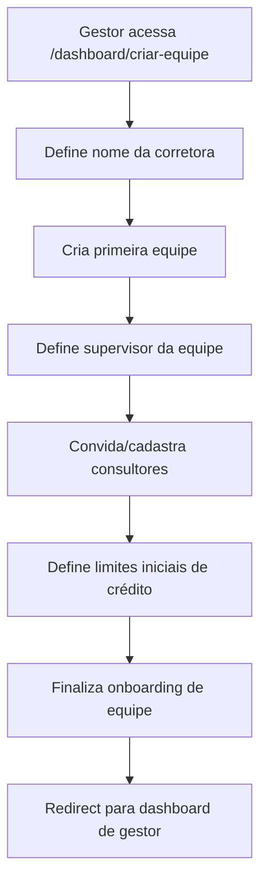
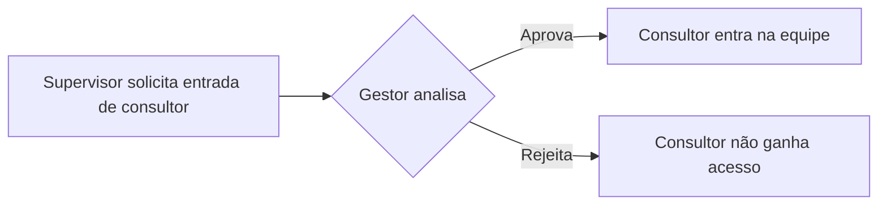
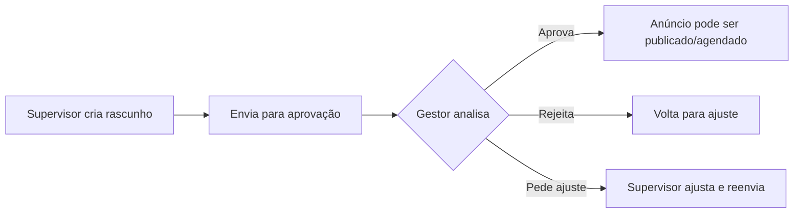
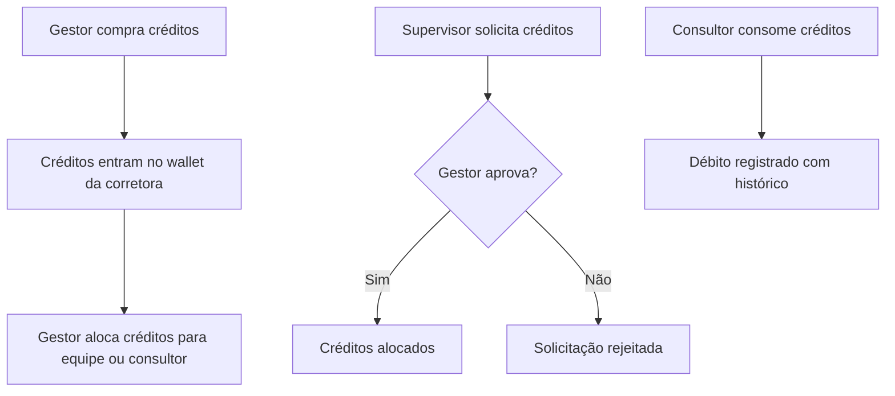

# Implementação do Plano Equipe — Leadi SaaS

> Documento de planejamento completo para transformar o workspace individual em workspace de equipe com papéis, permissões, aprovações, distribuição de leads, créditos por equipe e dashboards específicos.
>
> **Regra fundamental**: este documento é apenas planejamento. Nenhum código funcional, migration, refatoração ou alteração de arquivo foi feito.

---

## 1. Visão geral

### Objetivo

Criar um módulo real de **Equipe** no Leadi que permita a um dono de corretora (Gestor) gerenciar supervisores e consultores com:

- hierarquia de papéis com permissões granulares;
- fluxo de aprovação para compras, créditos e anúncios;
- distribuição e isolamento de leads por equipe/consultor;
- créditos segmentados por workspace, equipe e usuário;
- dashboards diferenciados por papel;
- segurança end-to-end (middleware, API, RLS, audit logs).

### Estado atual do projeto

O Leadi hoje possui:

- **3 papéis canônicos no schema**: `owner`, `admin`, `seller` (definidos em `ProfileRole` e `WorkspaceMemberRole`).
- **2 tipos de workspace**: `solo` e `team`.
- **Tela placeholder** em `/dashboard/criar-equipe` com texto estático "Criar equipe" / "Estrutura preparada".
- **Gestão básica de equipe** em `/team/setup` com convites, promoção/rebaixamento e remoção.
- **Middleware** com guards para rotas protegidas por papel e tipo de workspace.
- **Helpers server-side** em `src/lib/workspaces/context.ts` e `permissions.ts`.
- **Sistema de créditos** com `org_ai_balances`, `ai_credit_ledger`, `ai_credit_orders`, `ai_credit_packages`, `ai_usage_events`.
- **Billing** com Mercado Pago, planos (`plans`), assinaturas (`subscriptions`), eventos de pagamento (`payment_events`).
- **Campanhas** com geração IA, publicação Meta, tentativas de publicação.
- **Leads** com ownership (`owner_profile_id`), funil, importação CSV, webhook, comentários, tarefas.
- **Integração Meta Ads** com `meta_integrations`, `meta_pages`, `meta_forms`, `meta_ad_accounts`.

### Drift de nomenclatura identificado

O schema usa `owner`/`admin`/`seller`, mas o produto precisa de `Gestor`/`Supervisor`/`Consultor`. A função `normalizeWorkspaceRole()` já converte `supervisor` → `admin`. Este módulo deve consolidar essa nomenclatura.

---

## 2. Decisões de produto

### Mapeamento de papéis técnicos ↔ papéis de produto

| Papel de produto | Papel técnico (DB) | Descrição |
|---|---|---|
| **Gestor** | `owner` | Dono da corretora, acesso total, poder financeiro final |
| **Supervisor** | `admin` | Gerencia equipe, sem acesso financeiro direto |
| **Consultor** | `seller` | Operacional, trabalha apenas seus leads |

### Decisões sobre compras e créditos

- **Gestor** é o único com poder financeiro final.
- **Supervisor NÃO paga diretamente**. Cria solicitações que sobem para aprovação do Gestor.
- **Consultor NÃO compra créditos**. Apenas usa créditos liberados.
- Flag `allow_supervisor_self_checkout` é melhoria futura, NÃO comportamento inicial.

### Decisões sobre anúncios

- Supervisor pode criar rascunho de anúncio, mas precisa de aprovação do Gestor.
- Consultor não acessa anúncios.

### Decisões sobre membros

- Supervisor pode convidar consultor, mas cadastro fica pendente de aprovação do Gestor.
- Supervisor pode solicitar remoção/desativação de consultor, mas precisa aprovação do Gestor.
- Gestor pode convidar e aprovar qualquer papel.

---

## 3. Hierarquia de papéis

### Gestor / Dono da corretora (`owner`)

**Descrição**: dono da corretora ou usuário master do workspace.

**Permissões**:

- Acesso total ao workspace.
- Gerencia billing, assinatura, pagamentos e plano.
- Compra créditos para corretora, equipe específica ou usuários específicos.
- Aprova/rejeita solicitações de compra de supervisores.
- Aprova/rejeita solicitações de publicação de anúncios.
- Cria, valida, pausa, retoma, cancela e acompanha anúncios.
- Cadastra supervisores e consultores.
- Aprova cadastro de consultores criado por supervisores.
- Aprova exclusão/desativação de consultores solicitada por supervisores.
- Vê todos os leads, equipes, supervisores e consultores.
- Importa e exporta leads.
- Configura conta Meta Ads da corretora.
- Configura integrações do workspace.
- Configura limites de uso, distribuição de créditos e permissões.
- Consulta consumo de créditos por corretora, equipe, supervisor e consultor.
- Acessa relatórios gerenciais.

**Dashboard do Gestor**:

- Nome do gestor e nome da corretora
- Plano atual
- Total de equipes e total de consultores
- Créditos disponíveis da corretora e créditos consumidos no mês
- Solicitações pendentes de aprovação
- Anúncios pendentes de aprovação
- Leads totais, novos, distribuídos e sem responsável
- Custo por lead (quando houver dados de campanha)
- Alertas de assinatura/billing

### Supervisor de equipe (`admin`)

**Descrição**: gerencia uma equipe de consultores, sem acesso financeiro final.

**Permissões**:

- Vê todos os leads da própria equipe.
- Importa leads.
- Distribui e redistribui leads para consultores da própria equipe.
- Vê anúncios rodando da equipe/corretora (conforme permissão).
- Cria campanhas/anúncios como rascunho → envia para aprovação do Gestor.
- Cria imagens, textos e mensagens com IA usando créditos disponíveis.
- Consulta créditos disponíveis da equipe.
- Cria solicitação de compra de créditos (equipe ou consultores específicos).
- Cria solicitação de publicação de anúncio.
- Cria solicitação de aumento de verba/turbinar anúncio.
- Convida/cadastra consultores (pendente de aprovação do Gestor).
- Solicita exclusão/desativação de consultor (pendente de aprovação do Gestor).

**NÃO pode**:

- Acessar billing, alterar assinatura ou dados de pagamento.
- Exportar leads.
- Configurar conta Meta principal da corretora.
- Ver leads de outras equipes (exceto se Gestor liberar futuramente).

**Dashboard do Supervisor**:

- Nome do supervisor, equipe e corretora
- Créditos disponíveis e consumidos pela equipe no mês
- Consultores ativos
- Leads novos da equipe e pendentes de distribuição
- Leads por consultor
- Solicitações enviadas ao gestor
- Anúncios criados e status de aprovação

### Consultor (`seller`)

**Descrição**: usuário operacional, trabalha apenas seus próprios leads.

**Permissões**:

- Vê apenas leads atribuídos a ele.
- Edita informações básicas dos próprios leads (conforme regras CRM).
- Movimenta leads no funil (se permitido).
- Cria mensagens com IA usando créditos liberados.
- Gera imagens/materiais com IA (se houver crédito).
- Vê nome da corretora, equipe e supervisor.
- Vê seus próprios indicadores.

**NÃO pode**:

- Acessar anúncios, criar campanhas, publicar anúncios.
- Acessar billing, comprar créditos.
- Importar, exportar, apagar ou arquivar leads.
- Ver leads de outros consultores.
- Convidar usuários, alterar permissões, configurar integrações.

**Dashboard do Consultor**:

- Nome da corretora, equipe, supervisor e consultor
- Créditos disponíveis para uso (se aplicável)
- Leads atribuídos e leads novos
- Próximos lembretes
- Mensagens geradas com IA
- Consumo individual de créditos

---

## 4. Matriz de permissões

| Recurso | Gestor | Supervisor | Consultor |
|---|:---:|:---:|:---:|
| Ver billing | ✅ | ❌ | ❌ |
| Comprar créditos | ✅ | ❌ | ❌ |
| Solicitar créditos | — | ✅ | ❌¹ |
| Aprovar compras/solicitações | ✅ | ❌ | ❌ |
| Ver créditos da equipe | ✅ | ✅ | ❌ |
| Ver créditos próprios | ✅ | ✅ | ✅ |
| Ver todos os leads (corretora) | ✅ | ❌ | ❌ |
| Ver leads da equipe | ✅ | ✅ | ❌ |
| Ver apenas próprios leads | ✅ | ✅ | ✅ |
| Importar leads | ✅ | ✅ | ❌ |
| Exportar leads | ✅ | ❌ | ❌ |
| Apagar/arquivar leads | ✅ | ❌² | ❌ |
| Distribuir leads | ✅ | ✅ | ❌ |
| Editar lead próprio | ✅ | ✅ | ✅ |
| Mover lead no funil | ✅ | ✅ | ✅ |
| Criar anúncio | ✅ | ✅³ | ❌ |
| Aprovar anúncio | ✅ | ❌ | ❌ |
| Publicar anúncio | ✅ | ❌ | ❌ |
| Ver anúncios rodando | ✅ | ✅ | ❌ |
| Configurar Meta Ads | ✅ | ❌ | ❌ |
| Convidar supervisor | ✅ | ❌ | ❌ |
| Convidar consultor | ✅ | ✅⁴ | ❌ |
| Aprovar consultor | ✅ | ❌ | ❌ |
| Remover/desativar usuário | ✅ | ✅⁵ | ❌ |
| Ver relatórios da corretora | ✅ | ❌ | ❌ |
| Ver relatórios da equipe | ✅ | ✅ | ❌ |
| Usar IA para mensagens | ✅ | ✅ | ✅ |
| Usar IA para imagens | ✅ | ✅ | ✅⁶ |

**Notas**:

1. Consultor solicitar créditos é feature futura opcional.
2. Supervisor pode solicitar arquivamento, mas ação final depende de configuração.
3. Supervisor cria rascunho; publicação exige aprovação do Gestor.
4. Supervisor convida consultor; cadastro fica pendente de aprovação do Gestor.
5. Supervisor solicita remoção; efetivação depende de aprovação do Gestor.
6. Se houver crédito liberado para o consultor.

---

## 5. Fluxos principais

### 5.1 Fluxo de criação de equipe



### 5.2 Fluxo de convite/cadastro de usuários

- **Gestor** pode convidar supervisor e consultor diretamente.
- **Supervisor** pode convidar consultor → fica pendente de aprovação do Gestor.
- **Status do convite**: `pending` → `accepted` | `expired` | `cancelled` | `rejected`.
- Usuário convidado recebe papel inicial definido no convite.
- Impedir escalada de privilégio (seller não vira admin sem aprovação de owner).

### 5.3 Fluxo de aprovação de consultor



### 5.4 Fluxo de remoção/desativação de consultor

- Supervisor solicita remoção → Gestor aprova ou rejeita.
- Preferir desativar em vez de apagar histórico.
- Leads do consultor removido ficam pendentes de redistribuição.

### 5.5 Fluxo de leads

- Lead importado pode ficar sem responsável inicialmente.
- **Gestor** vê todos os leads.
- **Supervisor** vê leads da própria equipe.
- **Consultor** vê apenas leads atribuídos a ele.
- Supervisor pode distribuir e redistribuir leads dentro da própria equipe.
- Consultor NÃO pode apagar, arquivar, importar nem exportar.
- Gestor pode exportar. Supervisor NÃO pode exportar inicialmente.

### 5.6 Fluxo de anúncios



- Gestor pode criar e publicar diretamente.
- Consultor NÃO acessa anúncios.

### 5.7 Fluxo de créditos



**Cálculo de solicitação por equipe**:

```
créditos_solicitados = créditos_por_consultor × quantidade_de_consultores_selecionados
```

Exemplo: 100 créditos/consultor × 8 consultores = 800 créditos solicitados.

**Status de solicitação**: `pending` → `approved` | `rejected` | `cancelled`.

**Campos obrigatórios de transação**: `actor_id`, `target_user_id`, `team_id`, `organization_id`, `amount`, `reason`, `metadata`, `created_at`.

### 5.8 Fluxo de billing

- Apenas Gestor acessa billing.
- Se assinatura cancelada/inadimplente → bloqueios conforme regra existente.
- Validar que Supervisor/Consultor não acessam rotas de billing.
- Botões de compra para **Supervisor** → "Solicitar créditos ao gestor".
- Botões de compra para **Consultor** → escondidos ou "Solicitar créditos" (feature futura).

---

## 6. Modelo de dados sugerido

### 6.1 Tabelas existentes que precisam de ajuste

#### `organizations`

Já possui: `id`, `name`, `type`, `owner_profile_id`, `slug`.

**Ajuste sugerido**: nenhum campo novo obrigatório. O `type: 'team'` já distingue equipe.

#### `profiles`

Já possui: `id`, `auth_user_id`, `organization_id`, `role`, `full_name`, `email`.

**Ajuste sugerido**: considerar adicionar `team_id` (nullable) para vincular perfil à equipe.

#### `workspace_members`

Já possui: `id`, `workspace_id`, `user_id`, `role`, `status`.

**Ajuste sugerido**: considerar adicionar `team_id` (nullable).

#### `invites`

Já possui: `id`, `token`, `workspace_id`, `created_by_user_id`, `role_to_assign`, `status`.

**Ajuste sugerido**: adicionar `team_id`, `requires_approval`, `approval_status`, `approved_by_user_id`.

#### `leads`

Já possui: `organization_id`, `owner_profile_id`.

**Ajuste sugerido**: considerar adicionar `team_id` para filtro por equipe.

### 6.2 Novas tabelas sugeridas

#### `teams`

```sql
CREATE TABLE teams (
  id UUID PRIMARY KEY DEFAULT gen_random_uuid(),
  organization_id UUID NOT NULL REFERENCES organizations(id),
  name TEXT NOT NULL,
  created_by_profile_id UUID NOT NULL REFERENCES profiles(id),
  is_active BOOLEAN NOT NULL DEFAULT true,
  created_at TIMESTAMPTZ NOT NULL DEFAULT now(),
  updated_at TIMESTAMPTZ NOT NULL DEFAULT now()
);
```

#### `team_members`

```sql
CREATE TABLE team_members (
  id UUID PRIMARY KEY DEFAULT gen_random_uuid(),
  team_id UUID NOT NULL REFERENCES teams(id),
  profile_id UUID NOT NULL REFERENCES profiles(id),
  organization_id UUID NOT NULL REFERENCES organizations(id),
  role TEXT NOT NULL CHECK (role IN ('supervisor', 'consultant')),
  status TEXT NOT NULL DEFAULT 'active' CHECK (status IN ('active', 'inactive', 'pending_approval')),
  added_by_profile_id UUID NOT NULL REFERENCES profiles(id),
  approved_by_profile_id UUID REFERENCES profiles(id),
  created_at TIMESTAMPTZ NOT NULL DEFAULT now(),
  updated_at TIMESTAMPTZ NOT NULL DEFAULT now(),
  UNIQUE (team_id, profile_id)
);
```

#### `approval_requests`

```sql
CREATE TABLE approval_requests (
  id UUID PRIMARY KEY DEFAULT gen_random_uuid(),
  organization_id UUID NOT NULL REFERENCES organizations(id),
  team_id UUID REFERENCES teams(id),
  request_type TEXT NOT NULL CHECK (request_type IN (
    'credit_purchase', 'credit_allocation', 'ad_publication',
    'ad_budget_increase', 'member_add', 'member_remove'
  )),
  status TEXT NOT NULL DEFAULT 'pending' CHECK (status IN (
    'pending', 'approved', 'rejected', 'cancelled'
  )),
  requested_by_profile_id UUID NOT NULL REFERENCES profiles(id),
  reviewed_by_profile_id UUID REFERENCES profiles(id),
  reviewed_at TIMESTAMPTZ,
  title TEXT NOT NULL,
  description TEXT,
  metadata JSONB NOT NULL DEFAULT '{}',
  created_at TIMESTAMPTZ NOT NULL DEFAULT now(),
  updated_at TIMESTAMPTZ NOT NULL DEFAULT now()
);
```

#### `credit_wallets`

```sql
CREATE TABLE credit_wallets (
  id UUID PRIMARY KEY DEFAULT gen_random_uuid(),
  organization_id UUID NOT NULL REFERENCES organizations(id),
  team_id UUID REFERENCES teams(id),
  profile_id UUID REFERENCES profiles(id),
  wallet_type TEXT NOT NULL CHECK (wallet_type IN ('organization', 'team', 'user')),
  available_credits INTEGER NOT NULL DEFAULT 0,
  created_at TIMESTAMPTZ NOT NULL DEFAULT now(),
  updated_at TIMESTAMPTZ NOT NULL DEFAULT now(),
  CONSTRAINT unique_wallet UNIQUE (organization_id, team_id, profile_id, wallet_type)
);
```

#### `credit_transactions`

```sql
CREATE TABLE credit_transactions (
  id UUID PRIMARY KEY DEFAULT gen_random_uuid(),
  organization_id UUID NOT NULL REFERENCES organizations(id),
  wallet_id UUID NOT NULL REFERENCES credit_wallets(id),
  team_id UUID REFERENCES teams(id),
  actor_id UUID NOT NULL REFERENCES profiles(id),
  target_user_id UUID REFERENCES profiles(id),
  transaction_type TEXT NOT NULL CHECK (transaction_type IN (
    'purchase', 'allocation', 'usage', 'refund', 'revocation'
  )),
  amount INTEGER NOT NULL,
  balance_after INTEGER NOT NULL,
  reason TEXT,
  reference_type TEXT,
  reference_id UUID,
  metadata JSONB NOT NULL DEFAULT '{}',
  created_at TIMESTAMPTZ NOT NULL DEFAULT now()
);
```

#### `credit_requests`

```sql
CREATE TABLE credit_requests (
  id UUID PRIMARY KEY DEFAULT gen_random_uuid(),
  organization_id UUID NOT NULL REFERENCES organizations(id),
  team_id UUID REFERENCES teams(id),
  requested_by_profile_id UUID NOT NULL REFERENCES profiles(id),
  approved_by_profile_id UUID REFERENCES profiles(id),
  request_type TEXT NOT NULL CHECK (request_type IN ('team', 'user', 'campaign', 'image')),
  status TEXT NOT NULL DEFAULT 'pending' CHECK (status IN (
    'pending', 'approved', 'rejected', 'cancelled'
  )),
  amount_requested INTEGER NOT NULL,
  amount_approved INTEGER,
  credits_per_consultant INTEGER,
  consultant_count INTEGER,
  reason TEXT NOT NULL,
  review_notes TEXT,
  metadata JSONB NOT NULL DEFAULT '{}',
  reviewed_at TIMESTAMPTZ,
  created_at TIMESTAMPTZ NOT NULL DEFAULT now(),
  updated_at TIMESTAMPTZ NOT NULL DEFAULT now()
);
```

#### `ad_approval_requests`

```sql
CREATE TABLE ad_approval_requests (
  id UUID PRIMARY KEY DEFAULT gen_random_uuid(),
  organization_id UUID NOT NULL REFERENCES organizations(id),
  team_id UUID REFERENCES teams(id),
  campaign_id UUID NOT NULL REFERENCES campaigns(id),
  requested_by_profile_id UUID NOT NULL REFERENCES profiles(id),
  reviewed_by_profile_id UUID REFERENCES profiles(id),
  status TEXT NOT NULL DEFAULT 'pending' CHECK (status IN (
    'pending', 'approved', 'rejected', 'needs_adjustment'
  )),
  review_notes TEXT,
  metadata JSONB NOT NULL DEFAULT '{}',
  reviewed_at TIMESTAMPTZ,
  created_at TIMESTAMPTZ NOT NULL DEFAULT now(),
  updated_at TIMESTAMPTZ NOT NULL DEFAULT now()
);
```

#### `lead_assignments`

```sql
CREATE TABLE lead_assignments (
  id UUID PRIMARY KEY DEFAULT gen_random_uuid(),
  organization_id UUID NOT NULL REFERENCES organizations(id),
  team_id UUID NOT NULL REFERENCES teams(id),
  lead_id UUID NOT NULL REFERENCES leads(id),
  assigned_to_profile_id UUID NOT NULL REFERENCES profiles(id),
  assigned_by_profile_id UUID NOT NULL REFERENCES profiles(id),
  previous_owner_profile_id UUID REFERENCES profiles(id),
  reason TEXT,
  created_at TIMESTAMPTZ NOT NULL DEFAULT now()
);
```

#### `audit_logs`

```sql
CREATE TABLE audit_logs (
  id UUID PRIMARY KEY DEFAULT gen_random_uuid(),
  organization_id UUID NOT NULL REFERENCES organizations(id),
  team_id UUID REFERENCES teams(id),
  actor_id UUID NOT NULL REFERENCES profiles(id),
  action TEXT NOT NULL,
  resource_type TEXT NOT NULL,
  resource_id UUID,
  details JSONB NOT NULL DEFAULT '{}',
  ip_address TEXT,
  created_at TIMESTAMPTZ NOT NULL DEFAULT now()
);
```

**Ações que devem gerar audit log**:

- Compra de créditos
- Solicitação de créditos
- Aprovação/rejeição de solicitação
- Publicação de anúncio
- Alteração de papel
- Convite de membro
- Remoção/desativação de membro
- Exportação de leads
- Distribuição de leads
- Alteração de configuração do workspace

---

## 7. Regras de RLS e backend

### Princípios fundamentais

1. **Nunca confiar em role vinda do client.** Sempre buscar role no server.
2. **Validar `organization_id`** em toda operação.
3. **Validar `team_id`** quando aplicável.
4. **Validar ownership do lead** antes de qualquer operação.
5. **Permissões devem ser validadas no backend/API E nas RLS policies.**

### RLS policies obrigatórias

| Tabela | Regra |
|---|---|
| `leads` | Consultor só vê leads com `owner_profile_id = current_profile_id()` |
| `leads` | Supervisor vê leads da própria equipe via `team_members` join |
| `leads` | Gestor vê todos os leads da `organization_id` |
| `teams` | Apenas membros da organization veem equipes |
| `team_members` | Consultor vê apenas seus dados de membro |
| `credit_wallets` | Consultor vê apenas wallet próprio |
| `credit_requests` | Supervisor vê apenas solicitações da própria equipe |
| `approval_requests` | Supervisor vê apenas próprias solicitações |
| `ad_approval_requests` | Supervisor vê apenas próprias solicitações |
| `subscriptions` | Apenas owner pode acessar |
| `payment_events` | Apenas owner pode acessar |
| `audit_logs` | Apenas owner pode ler |

### Bloqueios obrigatórios de RLS

- ❌ Consultor ver leads de outros consultores
- ❌ Supervisor ver leads de outras equipes
- ❌ Supervisor acessar billing
- ❌ Consultor acessar billing
- ❌ Consultor acessar anúncios/campanhas
- ❌ Usuário criar role maior para si mesmo
- ❌ Supervisor aprovar as próprias solicitações financeiras
- ❌ Consultor importar/exportar/apagar leads

---

## 8. UI/UX por papel

### 8.1 Transformar tela atual de "Criar equipe"

**Arquivo atual**: `app/dashboard/criar-equipe/page.tsx`

- Transformar de placeholder em módulo real com fluxo de criação de equipe step-by-step.
- Requer: nome da corretora, criação de primeira equipe, definição de supervisor, convite de consultores, limites de crédito.

### 8.2 Visão do Gestor

- Dashboard com cards: créditos totais, leads totais, equipes, consultores, solicitações pendentes.
- Tela de aprovações (créditos, anúncios, membros).
- Tela de todas as equipes com drill-down.
- Relatórios gerenciais.
- Sidebar com navegação completa: Dashboard, Leads, Equipes, Campanhas, Créditos, Relatórios, Configurações.

### 8.3 Visão do Supervisor

- Dashboard com cards: créditos da equipe, leads da equipe, consultores, solicitações enviadas.
- Tela de distribuição de leads.
- Tela de membros da equipe.
- Tela de solicitações (créditos, anúncios).
- Sidebar reduzida: Dashboard, Leads da Equipe, Distribuir Leads, Campanhas (rascunho), Créditos da Equipe.

### 8.4 Visão do Consultor

- Dashboard simplificado: leads atribuídos, créditos disponíveis, lembretes, mensagens IA.
- Sem links para billing, campanhas, equipe, importação.
- Sidebar mínima: Dashboard, Meus Leads, Créditos.

### 8.5 Identidade no dashboard

- **Gestor**: `[Nome do Gestor] · [Nome da Corretora]`
- **Supervisor**: `[Nome] · Supervisor · [Equipe] · [Corretora]`
- **Consultor**: `[Nome] · Consultor · [Equipe] · [Supervisor] · [Corretora]`

### 8.6 Cards de status por papel

| Card | Gestor | Supervisor | Consultor |
|---|:---:|:---:|:---:|
| Créditos (corretora) | ✅ | — | — |
| Créditos (equipe) | ✅ | ✅ | — |
| Créditos (próprio) | — | — | ✅ |
| Leads totais | ✅ | — | — |
| Leads da equipe | ✅ | ✅ | — |
| Leads atribuídos | — | — | ✅ |
| Solicitações pendentes | ✅ | ✅ | — |
| Anúncios pendentes | ✅ | ✅ | — |
| Total de equipes | ✅ | — | — |
| Consultores ativos | ✅ | ✅ | — |

### 8.7 Telas novas necessárias

1. **Tela de solicitações** — lista de solicitações pendentes/histórico (Supervisor cria, Gestor aprova).
2. **Tela de aprovações** — Gestor vê tudo pendente, pode aprovar/rejeitar em batch.
3. **Tela de membros/equipe** — listar equipes, membros, status.
4. **Tela de distribuição de leads** — Supervisor seleciona leads sem dono e atribui a consultores.
5. **Estados vazios** — cada tela deve ter estado vazio bem feito com CTA contextual.
6. **Bloqueios visuais** — componentes que mostram mensagem clara quando o papel não tem permissão.

### 8.8 Mensagens de permissão

Quando o papel não tem permissão para uma ação, mostrar mensagem clara:

- Supervisor tentando acessar billing: "Apenas o gestor pode acessar pagamentos e assinatura."
- Consultor tentando importar: "Importação de leads é feita pelo supervisor da sua equipe."
- Supervisor tentando publicar anúncio: "Envie para aprovação do gestor antes de publicar."

---

## 9. Página comercial do Plano Equipe

### Objetivo

Convencer o dono/gestor da corretora a implantar o Leadi na equipe.

### CTAs sugeridos

- "Quero organizar minha equipe"
- "Usar Leadi na minha corretora"
- "Conhecer plano para equipes"

### Conteúdo da página

- Controle de leads por equipe
- Distribuição de leads para consultores
- Supervisão de performance
- IA para mensagens e materiais
- Controle de créditos por equipe
- Aprovação de anúncios antes de publicar
- Centralização da conta Meta Ads
- Menos planilhas e menos perda de leads
- Visão do gestor sobre equipes, consultores, créditos e campanhas

### Explicações de papéis para o cliente

- **Consultor**: "Trabalha apenas nos leads dele, sem acesso a pagamentos ou configurações."
- **Supervisor**: "Organiza a operação da equipe, sem acessar dados financeiros."
- **Gestor**: "Mantém controle total: financeiro, estratégico e de acesso."

### Localização sugerida

- Seção na `/pricing` ou página dedicada `/pricing/equipe`
- Card "Plano Equipe" no dashboard de owner solo

---

## 10. Integração com créditos

### Modelo de créditos para equipe

**Tipos de wallet**:

1. **Wallet da organização** — saldo principal, gerido pelo Gestor.
2. **Wallet da equipe** — saldo alocado para uma equipe específica.
3. **Wallet do usuário** — saldo alocado para um consultor específico.

### Comportamento

- Gestor compra créditos → entram no wallet da organização.
- Gestor pode alocar créditos: organização → equipe OU organização → usuário.
- Supervisor solicita créditos para equipe ou consultores específicos.
- Consultor consome créditos do seu wallet pessoal OU do wallet da equipe (conforme config).

### Cálculo de solicitação por equipe (UI e backend)

```
amount_requested = credits_per_consultant × selected_consultant_count
```

A UI deve mostrar:

```
[ 100 ] créditos por consultor × [ 8 ] consultores selecionados = [ 800 ] créditos solicitados
```

### Relação com sistema existente

O sistema atual usa `org_ai_balances` (saldo por org), `ai_credit_ledger` (histórico) e `ai_credit_orders` (compras). O novo sistema de wallets deve:

- Manter `org_ai_balances` como saldo master.
- `credit_wallets` para equipes e usuários como sub-wallets.
- `credit_transactions` para rastreabilidade granular.
- `credit_requests` para solicitações com aprovação.

---

## 11. Integração com anúncios

### Tabela existente: `campaigns`

Já possui: `organization_id`, `created_by_profile_id`, `publish_mode`, `publication_status`.

### Ajustes necessários

- Adicionar `team_id` (nullable) à tabela `campaigns`.
- Criar `ad_approval_requests` para fluxo de aprovação.
- Adicionar `approval_status` à campanha: `not_required`, `pending`, `approved`, `rejected`, `needs_adjustment`.

### Regras

- Se `created_by` é Gestor → `approval_status = 'not_required'`, pode publicar diretamente.
- Se `created_by` é Supervisor → `approval_status = 'pending'`, precisa aprovação do Gestor.
- Consultor não pode criar campanhas (bloqueio em API + UI).

---

## 12. Integração com leads

### Tabela existente: `leads`

Já possui: `organization_id`, `owner_profile_id`.

### Ajustes necessários

- Considerar adicionar `team_id` para filtro mais eficiente.
- Criar `lead_assignments` para histórico de distribuição.
- Ajustar RLS para filtrar por papel:
  - `seller` → `owner_profile_id = current_profile_id()`
  - `admin` → leads da equipe via join com `team_members`
  - `owner` → `organization_id` match

### Distribuição de leads

- Supervisor seleciona leads sem `owner_profile_id` (ou sem `team_id`).
- Atribui a consultores da sua equipe.
- Cada atribuição gera registro em `lead_assignments` + audit log.
- Lead redistribuído muda `owner_profile_id` e gera novo registro.

---

## 13. Integração com billing

### Estado atual

- Tabelas: `plans`, `subscriptions`, `payment_events`, `ai_credit_orders`.
- Checkout via Mercado Pago em `/api/billing/mercadopago/checkout`.
- Catálogo em `src/lib/billing/catalog.ts` com 3 planos + 3 packs.
- Plano Equipe já existe como `operation_plan` (R$249, 150 créditos).

### Ajustes necessários

- Validar que apenas `owner` acessa rotas de billing no backend (além do middleware).
- Criar lógica de "Solicitar créditos ao gestor" para Supervisor.
- Esconder botões de compra para Consultor.
- Para Supervisor, trocar "Comprar agora" → "Solicitar créditos ao gestor".
- Validar que bloqueios por inadimplência afetam toda a organização.

### Arquivos que precisam de atenção

- `app/dashboard/creditos/credits-workspace.tsx` — botões de compra
- `src/lib/billing/catalog.ts` — catálogo
- `app/api/billing/mercadopago/checkout` — rota de checkout
- `app/api/billing/create-subscription` — criação de assinatura
- `src/lib/billing/subscription-limits.server.ts` — limites
- `app/checkout/page.tsx` — página de checkout

---

## 14. Segurança e auditoria

### Regras obrigatórias de segurança

1. **Não confiar em role vinda do client**. Buscar role sempre no server via `getCurrentWorkspaceContext()`.
2. **Validar `organization_id`** em toda API route e server action.
3. **Validar `team_id`** quando a operação for limitada a uma equipe.
4. **Validar ownership do lead** antes de read/write.
5. **Validar permissões em todas as APIs** — não apenas UI.
6. **Conferir middleware** para novas rotas.
7. **Conferir server actions** para novas ações.
8. **Conferir API routes** para novos endpoints.
9. **Conferir Supabase RLS** para novas tabelas e ajustes.
10. **Conferir que chaves sensíveis não aparecem no client**.
11. **Conferir que Meta connection só é gerenciada pelo Gestor**.
12. **Criar audit logs** para ações sensíveis.

### Testes de segurança obrigatórios

- Tentativa de Supervisor acessar rota de billing → 403
- Tentativa de Consultor criar campanha via API → 403
- Tentativa de Consultor importar leads via API → 403
- Tentativa de Consultor exportar leads via API → 403
- Tentativa de Consultor acessar leads de outro consultor → 0 resultados
- Tentativa de Supervisor acessar leads de outra equipe → 0 resultados
- Tentativa de usuário alterar próprio role para owner → erro
- Tentativa de Supervisor aprovar própria solicitação financeira → erro
- Cross-org access via manipulação de organization_id → erro

---

## 15. Testes necessários

### Testes de acesso a leads

- [ ] Gestor vê todos os leads da corretora
- [ ] Supervisor vê apenas leads da própria equipe
- [ ] Consultor vê apenas leads atribuídos a ele
- [ ] Consultor não vê leads de outros consultores (API + RLS)

### Testes de billing

- [ ] Supervisor não acessa billing
- [ ] Consultor não acessa billing
- [ ] Apenas Gestor inicia checkout

### Testes de campanhas/anúncios

- [ ] Consultor não acessa campanhas/anúncios (UI + API)
- [ ] Consultor não cria anúncio via API
- [ ] Supervisor cria rascunho de anúncio
- [ ] Supervisor não publica sem aprovação
- [ ] Gestor aprova anúncio
- [ ] Gestor rejeita anúncio

### Testes de créditos

- [ ] Supervisor cria solicitação de créditos
- [ ] Gestor aprova solicitação de créditos
- [ ] Gestor rejeita solicitação de créditos
- [ ] Consumo de crédito registra histórico
- [ ] Solicitação calcula corretamente: `créditos_por_consultor × quantidade_consultores`

### Testes de membros

- [ ] Consultor não importa leads
- [ ] Consultor não exporta leads
- [ ] Supervisor não exporta leads
- [ ] Usuário não altera role para Gestor

### Testes de isolamento

- [ ] RLS bloqueia acesso cruzado entre organizations
- [ ] RLS bloqueia acesso cruzado entre teams

---

## 16. Lista de tarefas por fase

---

### FASE 0 — Auditoria do estado atual

#### Tarefa F0.1 — Mapear rotas existentes e guards de permissão

- [x] Concluído

> **Data:** 29/05/2026
> **Resumo:** Mapeamento completo de todas as rotas (pages e APIs) e guards, documentando as regras aplicadas e identificando gaps. Nenhuma alteração funcional foi feita.
> **Arquivos criados:** `docs/REFERENCIA_ROTAS_GUARDS.md`
> **Comandos executados:** Nenhum teste quebrou, sem alteração de código.
> **Pendências:** Resolver gaps apontados no futuro (como controle em APIs de billing).

**Objetivo**: documentar todas as rotas do dashboard, API e pages, e quais guards de permissão cada uma usa.

**Arquivos prováveis**:
- `middleware.ts`
- `app/dashboard/*/page.tsx`
- `app/api/*/route.ts`
- `app/team/*/page.tsx`
- `src/lib/workspaces/context.ts`

**O que fazer**:
- Listar cada rota com: path, guard usado, papel necessário, workspace type.
- Identificar rotas sem guard adequado.
- Documentar em um arquivo de referência.

**Critérios de aceite**:
- Tabela completa de rotas + guards existentes.
- Lista de rotas que precisarão de ajuste para o módulo de equipe.

**Riscos/cuidados**:
- Não alterar nenhum arquivo funcional nesta tarefa.

**Prompt futuro**: "Execute a Tarefa F0.1 do docs/IMPLEMENTACAO_PLANO_EQUIPE.md. Apenas documente rotas e guards, sem alterar código."

---

#### Tarefa F0.2 — Mapear tabelas e RLS existentes

- [x] Concluído

> **Data:** 29/05/2026
> **Resumo:** Mapeamento completo de todas as tabelas dependentes de organização e suas políticas RLS. Análise de gaps e necessidades de novas tabelas/ajustes para times documentadas. Nenhuma alteração funcional no banco de dados foi efetuada.
> **Arquivos criados:** `docs/REFERENCIA_TABELAS_RLS.md`
> **Comandos executados:** Buscas via código (`grep`/`node`) no schema do Supabase. Validações npm passaram limpas.
> **Pendências:** Aplicar os novos `team_id` e políticas nas tabelas citadas na próxima fase.

**Objetivo**: documentar todas as tabelas, colunas de `organization_id` e policies RLS.

**Arquivos prováveis**:
- `src/lib/supabase/database.types.ts`
- `supabase/migrations/*.sql`

**O que fazer**:
- Listar tabelas com `organization_id`.
- Listar policies RLS existentes.
- Identificar tabelas sem RLS adequada.
- Identificar tabelas que precisarão de `team_id`.

**Critérios de aceite**:
- Mapa completo de tabelas + RLS.
- Lista de gaps para o módulo de equipe.

**Riscos/cuidados**:
- Não alterar nenhuma migration.

**Prompt futuro**: "Execute a Tarefa F0.2 do docs/IMPLEMENTACAO_PLANO_EQUIPE.md. Apenas documente tabelas e RLS existentes."

---

#### Tarefa F0.3 — Mapear sistema de créditos atual

- [x] Concluído

> **Data:** 29/05/2026
> **Resumo:** Mapeamento completo do sistema de créditos atual (tabelas, fluxo e rpcs). Gerado o documento REFERENCIA_SISTEMA_CREDITOS.md com o descritivo de integrações e fluxogramas necessários para a implementação futura dos wallets por time.
> **Arquivos criados:** `docs/REFERENCIA_SISTEMA_CREDITOS.md`
> **Comandos executados:** `npm run typecheck`, `npm run lint`.
> **Pendências:** Implementar de fato os sub-wallets na Fase 2.

**Objetivo**: entender fluxo completo de créditos: compra, consumo, ledger, balances.

**Arquivos prováveis**:
- `src/lib/ai/credits.ts`
- `src/lib/ai/credit-orders.server.ts`
- `src/lib/ai/credit-packages.ts`
- `src/lib/ai/credit-costs.ts`
- `app/api/billing/ai-credits/`
- `app/dashboard/creditos/`
- `supabase/migrations/202605140003_ai_credits.sql`
- `supabase/migrations/202605280001_ai_credit_commerce.sql`

**O que fazer**:
- Documentar fluxo de compra → ledger → balance.
- Documentar RPCs usadas.
- Identificar pontos de integração para wallets por equipe/usuário.

**Critérios de aceite**:
- Fluxograma do sistema de créditos atual.
- Lista de integrações necessárias.

**Riscos/cuidados**:
- Área sensível (billing/créditos). Apenas documentar.

**Prompt futuro**: "Execute a Tarefa F0.3 do docs/IMPLEMENTACAO_PLANO_EQUIPE.md. Documente o sistema de créditos atual sem alterar código."

---

#### Tarefa F0.4 — Mapear sistema de campanhas e publicação

- [x] Concluído

> **Data:** 29/05/2026
> **Resumo:** Mapeamento do fluxo de criação, preparação e publicação de campanhas com Meta Ads, identificando pontos críticos de inserção para o fluxo de aprovação de anúncios pela equipe. Nenhuma alteração funcional foi feita.
> **Arquivos criados:** `docs/REFERENCIA_SISTEMA_CAMPANHAS.md`
> **Comandos executados:** npm run lint
> **Pendências:** Implementar fluxo de aprovação e bloqueios em F2.4 e fases seguintes.

**Objetivo**: entender fluxo de criação, publicação e Meta Ads.

**Arquivos prováveis**:
- `src/lib/campaigns/repository.server.ts`
- `src/lib/campaigns/types.ts`
- `app/dashboard/campanhas/campaign-generator.tsx`
- `app/api/campaigns/`
- `src/lib/meta/`

**O que fazer**:
- Documentar fluxo de campanha: geração → preparação → publicação.
- Identificar onde inserir fluxo de aprovação.

**Critérios de aceite**:
- Fluxograma do sistema de campanhas atual.
- Pontos de inserção para aprovação.

**Riscos/cuidados**:
- Área sensível (Meta Ads). Apenas documentar.

**Prompt futuro**: "Execute a Tarefa F0.4 do docs/IMPLEMENTACAO_PLANO_EQUIPE.md. Documente o sistema de campanhas atual."

---

#### Tarefa F0.5 — Mapear sistema de leads e ownership

- [x] Concluído

**Data**: 2026-05-29
**Resumo**: Mapeado o sistema atual de leads, ownership e RLS. A lógica de isolamento no repositório (`getLeadsCountForCurrentUser`, `buildLeadQuery`, `assignLeadOwnersInBulkForCurrentUser`) foi documentada em `docs/REFERENCIA_SISTEMA_LEADS.md`. Detalhamos como a restrição por papel é feita hoje (seller vs admin) e definimos as mudanças necessárias para filtrar por equipe. Nenhuma alteração funcional foi executada.
**Arquivos alterados**:
- `docs/REFERENCIA_SISTEMA_LEADS.md` (criado)
**Comandos executados**: `npm run lint`, `npm run test`
**Pendências**: Nenhuma

**Objetivo**: entender filtros de leads por papel, ownership, importação e exportação.

**Arquivos prováveis**:
- `src/lib/leads/repository.server.ts`
- `src/lib/leads/filters.ts`
- `app/api/leads/route.ts`
- `app/api/leads/export/`
- `app/dashboard/leads/leads-workspace.tsx`

**O que fazer**:
- Documentar como leads são filtrados por papel.
- Documentar `owner_profile_id` e como é usado.
- Identificar ajustes para filtro por equipe.

**Critérios de aceite**:
- Fluxo documentado de leads por papel.
- Lista de ajustes necessários.

**Riscos/cuidados**:
- Não alterar repository nem filtros.

**Prompt futuro**: "Execute a Tarefa F0.5 do docs/IMPLEMENTACAO_PLANO_EQUIPE.md. Documente o sistema de leads e ownership atual."

---

### FASE 1 — Arquitetura de papéis e permissões

#### Tarefa F1.1 — Criar permission map centralizado

- [x] Concluído

> **Data:** 29/05/2026
> **Resumo:** Criado o enum de permissões e o objeto `PERMISSION_MAP` como base centralizada (source of truth) de acesso por papel, mapeando as permissões para `owner`, `admin` e `seller`. Nenhuma função original do `permissions.ts` foi modificada ainda para garantir retrocompatibilidade total nesta etapa.
> **Arquivos criados:** `src/lib/workspaces/permission-map.ts`
> **Comandos executados:** `npm run lint`, `npm run build`
> **Pendências:** Integrar esse mapeamento aos helpers e guards (Tarefa F1.2 e F1.3).

**Objetivo**: criar um mapa de permissões por papel como source-of-truth em código.

**Arquivos prováveis**:
- `src/lib/workspaces/permissions.ts` (expandir)
- `src/lib/workspaces/permission-map.ts` (novo)

**O que fazer**:
- Criar `PERMISSION_MAP` com todas as permissões da matriz (seção 4).
- Criar enum `Permission` com todas as ações.
- Mapear cada `Permission` para os papéis que a possuem.

**Critérios de aceite**:
- Mapa completo com todos os 25+ recursos da matriz.
- Tipagem segura com TypeScript.
- Exportável para uso em server e client.

**Riscos/cuidados**:
- Não alterar funções existentes de permissions.ts ainda.
- Manter retrocompatibilidade.

**Prompt futuro**: "Implemente a Tarefa F1.1 do docs/IMPLEMENTACAO_PLANO_EQUIPE.md. Crie o permission map como novo arquivo sem alterar permissions.ts existente."

---

#### Tarefa F1.2 — Criar helper `can()`

- [x] Concluído

> **Data:** 29/05/2026
> **Resumo:** Criados os helpers `can`, `canOrThrow`, `canAll` e `canAny` usando o `PERMISSION_MAP`. Eles foram adicionados ao arquivo `permissions.ts` mantendo a retrocompatibilidade. Adicionados testes unitários completos no arquivo `permissions.test.ts` cobrindo comportamento padrão e fallback de normalização de role.
> **Arquivos alterados/criados:** `src/lib/workspaces/permissions.ts`, `src/lib/workspaces/permissions.test.ts`
> **Comandos executados:** `npm run lint`, `npm run test`
> **Pendências:** Nenhuma.

**Objetivo**: criar helper reutilizável para checar permissão por papel.

**Arquivos prováveis**:
- `src/lib/workspaces/permission-map.ts`
- `src/lib/workspaces/permissions.ts`

**O que fazer**:
- Criar `can(role: WorkspaceRole, permission: Permission): boolean`.
- Criar `canOrThrow()` para uso em server actions.
- Criar `canAll()` e `canAny()` para checar múltiplas permissões.

**Critérios de aceite**:
- `can('seller', 'view_billing')` retorna `false`.
- `can('owner', 'view_billing')` retorna `true`.
- Testes unitários para cada combinação papel+permissão.

**Riscos/cuidados**:
- Helper deve funcionar tanto no server quanto no client (sem dependências server-only no core).

**Prompt futuro**: "Implemente a Tarefa F1.2 do docs/IMPLEMENTACAO_PLANO_EQUIPE.md. Crie o helper can() com testes."

---

#### Tarefa F1.3 — Criar helpers server-side com contexto de equipe

- [x] Concluído

> **Data:** 29/05/2026
> **Resumo:** O `WorkspaceContext` foi expandido para incluir `teamId`, `teamName` e `supervisorName` como dados opcionais. Foram criados os helpers `requireTeamMember()` e o genérico `requirePermission(permission: Permission)` em `src/lib/workspaces/context.ts`, mantendo a retrocompatibilidade dos helpers de perfil, owner e admin.
> **Arquivos alterados:** `src/lib/workspaces/context.ts`
> **Comandos executados:** `npm run lint`, `npm run build`
> **Pendências:** Integrar e preencher com dados reais de `teams` e `team_members` na base de dados quando implementados na Fase 2.

**Objetivo**: expandir `WorkspaceContext` para incluir dados de equipe.

**Arquivos prováveis**:
- `src/lib/workspaces/context.ts`

**O que fazer**:
- Adicionar `teamId`, `teamName`, `supervisorName` ao `WorkspaceContext`.
- Criar `requireTeamMember()` para exigir que o usuário pertença a uma equipe.
- Criar `requirePermission(permission: Permission)` genérico.
- Manter `requireWorkspaceManager()` e `requireSoloOwner()` funcionando.

**Critérios de aceite**:
- Contexto retorna `teamId` e `teamName` quando aplicável.
- Helpers existentes não quebram.
- `DashboardNavVariant` expandido para `supervisor-team` (se necessário).

**Riscos/cuidados**:
- Alterar contexto impacta todo o dashboard. Testar regressão.
- Precisa de tabela `teams` + `team_members` (FASE 2 ou criar como stub).

**Prompt futuro**: "Implemente a Tarefa F1.3 do docs/IMPLEMENTACAO_PLANO_EQUIPE.md. Expanda WorkspaceContext para equipes."

---

#### Tarefa F1.4 — Definir enum de roles e glossário

- [x] Concluído

> **Data:** 29/05/2026
> **Resumo:** Criado o dicionário `ROLE_LABELS` mapeando papéis técnicos para os rótulos de produto (`owner` -> Gestor, `admin` -> Supervisor, `seller` -> Consultor) com JSDoc. Verificada a ausência de aliases legados como `requireSoloSeller` e `requireSupervisor` no código.
> **Arquivos alterados:** `src/lib/workspaces/permissions.ts`
> **Comandos executados:** `npm run typecheck && npm run lint`, ambos sem erros.
> **Pendências:** Nenhuma.


**Objetivo**: consolidar nomenclatura de papéis eliminando drift.

**Arquivos prováveis**:
- `src/lib/workspaces/permissions.ts`
- `src/lib/supabase/database.types.ts` (referência)

**O que fazer**:
- Criar constantes `ROLE_LABELS` com mapeamento `owner → 'Gestor'`, `admin → 'Supervisor'`, `seller → 'Consultor'`.
- Documentar em JSDoc a correspondência entre papel técnico e produto.
- Remover aliases legados como `requireSoloSeller()` ou `requireSupervisor()` se existirem.

**Critérios de aceite**:
- Um único arquivo de referência para labels de papéis.
- Copy na UI usa labels do glossário.

**Riscos/cuidados**:
- Verificar se a remoção de aliases quebra alguma referência.

**Prompt futuro**: "Implemente a Tarefa F1.4 do docs/IMPLEMENTACAO_PLANO_EQUIPE.md. Consolide nomenclatura de papéis."

---

### FASE 2 — Banco de dados e RLS

#### Tarefa F2.1 — Criar tabela `teams` e `team_members`

- [x] Concluído
  - **Data**: 2026-05-29
  - **Resumo**: Criadas as tabelas `teams` e `team_members` com índices e RLS isolado por organização. Políticas definem acesso de owners (total na org), admins (podem gerenciar próprios times) e sellers (veem apenas o próprio vínculo).
  - **Arquivos alterados**: `supabase/migrations/202605290001_teams.sql`, `src/lib/supabase/database.types.ts`
  - **Comandos executados**: `npm run lint`, `npm run build`
  - **Pendências**: Nenhuma.

**Objetivo**: criar estrutura de equipes dentro de uma organização.

**Arquivos prováveis**:
- `supabase/migrations/YYYYMMDD_teams.sql` (nova)
- `src/lib/supabase/database.types.ts` (atualizar tipos)

**O que fazer**:
- Criar tabela `teams` com `organization_id`, `name`, `is_active`.
- Criar tabela `team_members` com `team_id`, `profile_id`, `role`, `status`.
- Criar indexes.
- Criar RLS policies básicas.

**Critérios de aceite**:
- Tabelas criadas com RLS habilitado.
- Owner vê todas as equipes da org.
- Admin vê apenas equipe própria.
- Seller vê apenas dados como membro.

**Riscos/cuidados**:
- Área sensível (banco de dados). Testar em ambiente de dev.
- Garantir `organization_id` em todos os registros.

**Prompt futuro**: "Implemente a Tarefa F2.1 do docs/IMPLEMENTACAO_PLANO_EQUIPE.md. Crie as tabelas teams e team_members com migration e RLS."

---

#### Tarefa F2.2 — Criar tabela `approval_requests`

- [x] Concluído

> **Data:** 29/05/2026
> **Resumo:** Criada a migration para a tabela `approval_requests` com RLS e índices, e atualizado o arquivo `database.types.ts` com o novo tipo.
> **Arquivos criados/alterados:** `supabase/migrations/202605290002_approval_requests.sql`, `src/lib/supabase/database.types.ts`
> **Comandos executados:** `npm run lint`, `npm run build`, `npm run test`
> **Resultado:** Lint passou com warnings não relacionados. Build concluiu. Os testes (`vitest`) falharam em arquivos não relacionados à alteração (`app/api/leads/route.test.ts`, `app/dashboard/funil/page.test.tsx` com erros sobre mock faltando para `listLeadOwnerOptionsForCurrentUser` e retornos HTTP 400 inesperados na API de leads). A falha **não** tem relação com a criação de `approval_requests`.
> **Pendências:** Correção dos testes relacionados a leads em futuras etapas.

**Objetivo**: criar estrutura genérica de solicitações com aprovação.

**Arquivos prováveis**:
- `supabase/migrations/YYYYMMDD_approval_requests.sql` (nova)
- `src/lib/supabase/database.types.ts`

**O que fazer**:
- Criar tabela `approval_requests` conforme modelo da seção 6.2.
- Criar RLS: supervisor vê próprias solicitações, owner vê todas da org.
- Criar indexes.

**Critérios de aceite**:
- Supervisor pode inserir com `status = 'pending'`.
- Supervisor NÃO pode atualizar `status` para `approved` (apenas owner).
- Owner pode aprovar/rejeitar.

**Riscos/cuidados**:
- RLS deve impedir supervisor de aprovar própria solicitação.

**Prompt futuro**: "Implemente a Tarefa F2.2 do docs/IMPLEMENTACAO_PLANO_EQUIPE.md. Crie a tabela approval_requests com RLS."

---

#### Tarefa F2.3 — Criar tabela de solicitações de crédito

- [x] Concluído

> **Data:** 29/05/2026
> **Resumo:** Criada a migration `202605290003_credit_requests.sql` com a nova tabela `credit_requests`, definindo as RLS policies para garantir que o supervisor possa solicitar mas apenas o gestor possa aprovar (além do gestor ter acesso total). O arquivo `database.types.ts` foi atualizado com a tipagem da nova tabela.
> **Arquivos criados/alterados:** `supabase/migrations/202605290003_credit_requests.sql`, `src/lib/supabase/database.types.ts`
> **Comandos executados:** `npm run lint`, `npm run build`, `npm run test`
> **Resultado:** Lint passou com apenas warnings preexistentes. Build concluiu. Os testes (`vitest`) falharam em partes não relacionadas ao módulo (APIs de leads e UI Meta), de acordo com histórico.
> **Pendências:** Correção dos testes relacionados a leads em futuras etapas.

**Objetivo**: permitir que supervisores solicitem créditos ao gestor sem acessar billing.

**Arquivos prováveis**:
- `supabase/migrations/YYYYMMDD_credit_requests.sql` (nova)
- `src/lib/supabase/database.types.ts`

**O que fazer**:
- Criar tabela `credit_requests` conforme modelo.
- Relacionar com `organization_id`, `team_id`, `requested_by`, `approved_by`.
- Status: `pending`, `approved`, `rejected`, `cancelled`.
- Guardar quantidade solicitada, `credits_per_consultant`, `consultant_count` e motivo.
- Registrar audit log.

**Critérios de aceite**:
- Supervisor consegue criar solicitação.
- Gestor consegue aprovar/rejeitar.
- Consultor não consegue aprovar.
- Supervisor não consegue aprovar a própria solicitação.
- Toda mudança gera histórico.

**Riscos/cuidados**:
- Não permitir bypass pela API.
- Validar `organization_id` no servidor.
- Criar RLS adequada.

**Prompt futuro**: "Implemente a Tarefa F2.3 do docs/IMPLEMENTACAO_PLANO_EQUIPE.md, mantendo o escopo limitado à tabela de solicitações de crédito, policies e testes relacionados."

---

#### Tarefa F2.4 — Criar tabela `ad_approval_requests`

- [x] Concluído

> **Data:** 29/05/2026
> **Resumo:** Criada a migration `202605290004_ad_approval_requests.sql` adicionando a tabela de solicitações de aprovação de anúncios. Configurado o RLS para acesso e inserção por supervisores e gestão total por owners. Adicionada a tipagem de `ad_approval_requests` em `database.types.ts`.
> **Arquivos alterados:** `supabase/migrations/202605290004_ad_approval_requests.sql` (novo), `src/lib/supabase/database.types.ts`
> **Comandos executados:** `npm run lint`, `npm run build`, `npm run test`
> **Pendências:** Correção dos testes não relacionados (funil, leads) que já falhavam por mocks ausentes de fases anteriores.

**Objetivo**: criar fluxo de aprovação de anúncios.

**Arquivos prováveis**:
- `supabase/migrations/YYYYMMDD_ad_approval_requests.sql` (nova)
- `src/lib/supabase/database.types.ts`

**O que fazer**:
- Criar tabela `ad_approval_requests` conforme modelo.
- Relacionar com `campaign_id`, `organization_id`, `team_id`.
- Status: `pending`, `approved`, `rejected`, `needs_adjustment`.

**Critérios de aceite**:
- Supervisor pode criar solicitação de aprovação.
- Gestor pode aprovar/rejeitar/pedir ajuste.
- Apenas campanhas aprovadas podem ser publicadas.

**Riscos/cuidados**:
- Área sensível (campanhas/Meta). Não alterar fluxo de publicação existente sem necessidade.

**Prompt futuro**: "Implemente a Tarefa F2.4 do docs/IMPLEMENTACAO_PLANO_EQUIPE.md. Crie a tabela ad_approval_requests."

---

#### Tarefa F2.5 — Criar tabela `credit_wallets` e `credit_transactions`

- [x] Concluído

**Execução 2026-05-29**
- Arquivos alterados: `supabase/migrations/202605290005_credit_wallets.sql`, `src/lib/supabase/database.types.ts`.
- O que foi feito: Criadas tabelas e as políticas RLS que suportarão carteiras de crédito por organização, equipe e usuário. Os tipos foram mapeados em `database.types.ts`.
- Validações: `npm run lint` e `npm run build` passaram com sucesso. `npm run test` registrou falhas isoladas provenientes de dependências legadas que testavam com mock desatualizado, sem regressão originada nesta task.
- Pendências: Nenhuma específica desta task.

**Objetivo**: permitir sub-wallets por equipe e usuário.

**Arquivos prováveis**:
- `supabase/migrations/YYYYMMDD_credit_wallets.sql` (nova)
- `src/lib/supabase/database.types.ts`

**O que fazer**:
- Criar `credit_wallets` e `credit_transactions` conforme modelo.
- Criar RLS: consultor vê apenas wallet próprio, supervisor vê da equipe, owner vê tudo.

**Critérios de aceite**:
- Wallet por organização, equipe e usuário.
- Transações registram actor, target, amount, balance_after.
- RLS impede acesso cross-team e cross-org.

**Riscos/cuidados**:
- Integrar com `org_ai_balances` existente sem quebrar fluxo atual.

**Prompt futuro**: "Implemente a Tarefa F2.5 do docs/IMPLEMENTACAO_PLANO_EQUIPE.md. Crie as tabelas credit_wallets e credit_transactions."

---

#### Tarefa F2.6 — Criar tabela `lead_assignments`

- [x] Concluído

**Execução 2026-05-29**
- Arquivos alterados: `supabase/migrations/202605290006_lead_assignments.sql`, `src/lib/supabase/database.types.ts`.
- O que foi feito: Criada a tabela `lead_assignments` para histórico de distribuição de leads, com vínculo obrigatório a organização, equipe, lead, responsável atual e usuário que realizou a atribuição. Também foram adicionados índices e políticas RLS para preservar o isolamento por organização e equipe sem alterar a tabela `leads`.
- Comandos executados: `npm run lint`, `npm run build` e `npm run test`.
- Resultado: `npm run lint` concluiu com 1 warning preexistente em `scratch/check_migrations.mjs`; `npm run build` concluiu com sucesso e repetiu apenas o aviso informativo já conhecido de uso dinâmico em `/dashboard` por `cookies`; `npm run test` falhou em suites preexistentes de `app/api/leads`, `app/dashboard/funil`, `app/dashboard/campanhas` e `app/dashboard/perfil`, sem indício de relação causal com a nova migration estrutural.
- Pendências: Validar o consumo desta tabela nas próximas tarefas de distribuição para que cada redistribuição grave `previous_owner_profile_id`.

**Objetivo**: registrar histórico de distribuição de leads.

**Arquivos prováveis**:
- `supabase/migrations/YYYYMMDD_lead_assignments.sql` (nova)
- `src/lib/supabase/database.types.ts`

**O que fazer**:
- Criar tabela conforme modelo.
- Relacionar com lead, equipe, perfis.

**Critérios de aceite**:
- Cada distribuição gera registro.
- Redistribuição registra `previous_owner_profile_id`.

**Riscos/cuidados**:
- Não alterar tabela `leads` diretamente nesta tarefa.

**Prompt futuro**: "Implemente a Tarefa F2.6 do docs/IMPLEMENTACAO_PLANO_EQUIPE.md. Crie a tabela lead_assignments."

---

#### Tarefa F2.7 — Criar tabela `audit_logs`

- [x] Concluído

#### Execução 2026-05-29
- Data: 2026-05-29 20:06
- Resumo do que foi feito: criada a migration `audit_logs` com trilha de auditoria por organização, leitura restrita a `owner` via RLS, inserção controlada por escopo autenticado e helper server-side com sanitização de metadados sensíveis.
- Arquivos alterados:
  - `supabase/migrations/202605290007_audit_logs.sql`
  - `src/lib/audit/audit-log.server.ts`
  - `src/lib/supabase/database.types.ts`
  - `docs/IMPLEMENTACAO_PLANO_EQUIPE.md`
  - `docs/LOG_EXECUCAO_TAREFAS.md`
- Comandos executados:
  - `git status --short`
  - `sed -n '1,220p' src/lib/supabase/admin.ts`
  - `sed -n '1,220p' src/lib/supabase/server.ts`
  - `sed -n '1,220p' src/lib/workspaces/context.ts`
  - `sed -n '1,220p' src/lib/logger.ts`
  - `sed -n '1,220p' supabase/migrations/202605290001_teams.sql`
  - `sed -n '1,260p' supabase/migrations/202605290005_credit_wallets.sql`
  - `sed -n '226,320p' src/lib/integrations/repository.server.ts`
  - `npm run security:check`
  - `npm run lint`
  - `npm run test`
  - `npm run build`
- Pendências:
  - Integrar o helper novo aos fluxos sensíveis que ainda não gravam auditoria persistente.
  - `npm run test` segue falhando por suites preexistentes fora do escopo desta tarefa.

**Objetivo**: registrar ações sensíveis para auditoria.

**Arquivos prováveis**:
- `supabase/migrations/YYYYMMDD_audit_logs.sql` (nova)
- `src/lib/supabase/database.types.ts`

**O que fazer**:
- Criar tabela `audit_logs` conforme modelo.
- RLS: apenas owner pode ler.
- Index por `organization_id`, `action`, `created_at`.

**Critérios de aceite**:
- Tabela criada com RLS.
- Helper server-side para inserir logs facilmente.

**Riscos/cuidados**:
- Logs não devem conter dados sensíveis (tokens, senhas, chaves).

**Prompt futuro**: "Implemente a Tarefa F2.7 do docs/IMPLEMENTACAO_PLANO_EQUIPE.md. Crie a tabela audit_logs com helper."

---

#### Tarefa F2.8 — Ajustar tabela `invites` para aprovação

- [x] Concluído

**Execução 2026-05-29 21:17**
- **Resumo**: adicionados os campos `team_id`, `requires_approval`, `approval_status` e `approved_by_user_id` em `invites`, com bloqueio de aceite enquanto o convite estiver pendente ou rejeitado. Convites novos criados por `admin` passam a nascer com `requires_approval = true` e `approval_status = 'pending'`, preservando convites legados como `not_required`.
- **Arquivos alterados**: `supabase/migrations/202605290008_invites_approval.sql`, `src/lib/supabase/database.types.ts`
- **Comandos executados**: `npm run lint`, `npm run test`, `npm run build`
- **Pendências**: a aprovação/rejeição operacional do convite e a UI correspondente continuam na `F3.2`.

**Objetivo**: adicionar campos de aprovação ao sistema de convites.

**Arquivos prováveis**:
- `supabase/migrations/YYYYMMDD_invites_approval.sql` (nova)
- `src/lib/supabase/database.types.ts`

**O que fazer**:
- Adicionar `team_id`, `requires_approval`, `approval_status`, `approved_by_user_id` à tabela `invites`.
- Ajustar RLS se necessário.

**Critérios de aceite**:
- Convite criado por supervisor tem `requires_approval = true`.
- Convite fica `pending` até gestor aprovar.

**Riscos/cuidados**:
- Área sensível (convites). Manter compatibilidade com fluxo atual.

**Prompt futuro**: "Implemente a Tarefa F2.8 do docs/IMPLEMENTACAO_PLANO_EQUIPE.md. Ajuste invites para suportar aprovação."

---

#### Tarefa F2.9 — Adicionar `team_id` em leads e campanhas

- [x] Concluído

**Execução 2026-05-29**:
- Resumo: criada a migration `202605290009_team_id_leads_campaigns.sql` para adicionar `team_id` nullable em `leads` e `campaigns`, com triggers de preenchimento automático em novos inserts e endurecimento da RLS de `leads` para restringir supervisores aos registros do próprio time, mantendo visibilidade ampla do `owner`.
- Arquivos alterados: `supabase/migrations/202605290009_team_id_leads_campaigns.sql`, `src/lib/supabase/database.types.ts`, `docs/IMPLEMENTACAO_PLANO_EQUIPE.md`, `docs/LOG_EXECUCAO_TAREFAS.md`.
- Comandos executados: `npm run lint`, `npm run test`, `npm run build`.
- Pendências: aplicar a migration no ambiente Supabase alvo e tratar falhas legadas da suíte de testes que não foram introduzidas por esta tarefa.

**Objetivo**: vincular leads e campanhas a equipes.

**Arquivos prováveis**:
- `supabase/migrations/YYYYMMDD_team_id_leads_campaigns.sql` (nova)
- `src/lib/supabase/database.types.ts`

**O que fazer**:
- Adicionar `team_id UUID REFERENCES teams(id)` nullable em `leads`.
- Adicionar `team_id UUID REFERENCES teams(id)` nullable em `campaigns`.
- Ajustar RLS de leads para filtrar por equipe quando `admin`.

**Critérios de aceite**:
- Coluna `team_id` nullable em ambas as tabelas.
- RLS de leads permite supervisor ver apenas leads da sua equipe.
- Leads sem `team_id` continuam visíveis para owner.

**Riscos/cuidados**:
- Área sensível (leads, campanhas). Testar regressão.

**Prompt futuro**: "Implemente a Tarefa F2.9 do docs/IMPLEMENTACAO_PLANO_EQUIPE.md. Adicione team_id em leads e campanhas."

---

### FASE 3 — Equipes e membros

#### Tarefa F3.1 — CRUD de equipes (server + API)

- [x] Concluído

**Execução 2026-05-29**:
- Resumo: expandida `src/lib/workspaces/team.ts` com CRUD server-side da tabela `teams`, validação explícita de `owner`, escopo por `organization_id` em todas as mutações e fallback mockado para ambiente sem Supabase; também foram criadas as rotas `GET/POST /api/teams` e `PATCH/DELETE /api/teams/[id]` com validação Zod, rate limit, `assertSameOrigin` nas mutações e mensagens de erro orientadas ao produto.
- Arquivos alterados: `src/lib/workspaces/team.ts`, `app/api/teams/route.ts`, `app/api/teams/[id]/route.ts`, `app/api/teams/route.test.ts`, `app/api/teams/[id]/route.test.ts`, `docs/IMPLEMENTACAO_PLANO_EQUIPE.md`, `docs/LOG_EXECUCAO_TAREFAS.md`.
- Comandos executados: `npm run test -- app/api/teams/route.test.ts app/api/teams/[id]/route.test.ts`, `npm run lint`, `npm run test`, `npm run build`.
- Pendências: a suíte global continua com falhas legadas fora do escopo em `app/api/leads/*`, `app/dashboard/funil/*`, `app/dashboard/campanhas/*` e `app/dashboard/perfil/*`; `npm run typecheck` não existe no `package.json`.

**Objetivo**: criar, listar, editar e desativar equipes.

**Arquivos prováveis**:
- `src/lib/workspaces/team.ts` (expandir)
- `app/api/teams/route.ts` (novo)
- `app/api/teams/[id]/route.ts` (novo)

**O que fazer**:
- Criar APIs REST para CRUD de equipes.
- Validar que apenas owner pode criar/editar equipes.
- Apenas owner pode desativar equipe.

**Critérios de aceite**:
- Owner cria equipe.
- Owner lista todas as equipes da org.
- Owner edita nome de equipe.
- Owner desativa equipe.
- Admin/seller não pode criar/editar equipe.

**Riscos/cuidados**:
- Validar `organization_id` em todas as operações.

**Prompt futuro**: "Implemente a Tarefa F3.1 do docs/IMPLEMENTACAO_PLANO_EQUIPE.md. Crie CRUD de equipes."

---

#### Tarefa F3.2 — Sistema de convites com aprovação

- [x] Concluído
- **Data**: 2026-05-29 22:04
- **Resumo**: o fluxo de convites passou a expor `approval_status` na camada server e na UI, com aviso de pendência para o gestor, botões de aprovar/rejeitar para convites pendentes, rota protegida `POST /api/invites/approve`, trilha de auditoria da revisão e mensagens específicas na tela de aceite para convites pendentes, rejeitados e expirados.
- **Arquivos alterados**: `app/team/setup/actions.ts`, `app/team/setup/team-setup-client.tsx`, `app/invite/[token]/page.tsx`, `src/lib/workspaces/team.ts`, `app/api/invites/approve/route.ts`, `app/api/invites/approve/route.test.ts`, `docs/IMPLEMENTACAO_PLANO_EQUIPE.md`, `docs/LOG_EXECUCAO_TAREFAS.md`
- **Comandos executados**: `npm run test -- app/api/invites/approve/route.test.ts`, `npm run lint`, `npm run test`, `npm run build`
- **Pendências**: a revisão operacional do convite exige `SUPABASE_SERVICE_ROLE_KEY` no servidor para efetivar o update com segurança; a suíte legada fora do escopo continua com 17 falhas já existentes.

**Objetivo**: expandir sistema de convites para suportar aprovação do gestor.

**Arquivos prováveis**:
- `app/team/setup/actions.ts` (ajustar)
- `src/lib/workspaces/team.ts` (expandir)
- `app/api/invites/approve/route.ts` (novo)

**O que fazer**:
- Quando supervisor convida consultor, convite fica `requires_approval = true`.
- Gestor recebe notificação de convite pendente.
- Gestor aprova ou rejeita.
- Se aprovado, convite é ativado.

**Critérios de aceite**:
- Supervisor cria convite pendente.
- Gestor aprova/rejeita.
- Convite rejeitado não permite acesso.
- Convite expirado não funciona.

**Riscos/cuidados**:
- Manter fluxo existente de aceite de convite funcionando.

**Prompt futuro**: "Implemente a Tarefa F3.2 do docs/IMPLEMENTACAO_PLANO_EQUIPE.md. Expanda convites com aprovação."

---

#### Tarefa F3.3 — Desativação de membros com aprovação

- [x] Concluído

**Execução 2026-05-29**
- Resumo: supervisores agora criam `approval_requests` de desativação para consultores da própria equipe; gestores podem aprovar ou rejeitar pela tela de equipe; ao aprovar, o membro é desativado, perde acesso ao workspace e os leads ficam sem `owner_profile_id` para redistribuição.
- Arquivos alterados: `src/lib/workspaces/team.ts`, `app/team/setup/actions.ts`, `app/team/setup/page.tsx`, `app/team/setup/team-setup-client.tsx`, `app/api/teams/members/deactivate/route.ts`, `app/api/teams/members/deactivate/route.test.ts`, `docs/IMPLEMENTACAO_PLANO_EQUIPE.md`, `docs/LOG_EXECUCAO_TAREFAS.md`.
- Comandos executados: `npm run test -- app/api/teams/members/deactivate/route.test.ts`, `npm run lint`, `npm run test`, `npm run build`.
- Pendências: `team_members` continua dependente de vínculos já existentes no banco para validar "consultor da própria equipe"; `npm run typecheck` não existe no `package.json`; a suíte completa de testes segue com falhas legadas fora do escopo.

**Objetivo**: permitir que supervisor solicite desativação de consultor.

**Arquivos prováveis**:
- `app/api/teams/members/deactivate/route.ts` (novo)
- `src/lib/workspaces/team.ts`

**O que fazer**:
- Supervisor solicita desativação → cria approval_request.
- Gestor aprova → membro desativado.
- Leads do membro ficam pendentes de redistribuição.

**Critérios de aceite**:
- Supervisor pode solicitar desativação de consultor da sua equipe.
- Gestor aprova → membro desativado.
- Leads ficam sem owner.
- Supervisor não pode desativar outro supervisor.

**Riscos/cuidados**:
- Não apagar dados do membro, apenas desativar.

**Prompt futuro**: "Implemente a Tarefa F3.3 do docs/IMPLEMENTACAO_PLANO_EQUIPE.md. Crie desativação de membros com aprovação."

---

#### Tarefa F3.4 — UI de membros e equipe

- [x] Concluído

**Execução 2026-05-30**
- Resumo: a área `team/setup` passou a exibir cards de equipes com contadores de ativos e pendentes, seleção de time para o gestor e escopo restrito ao time do supervisor.
- Arquivos alterados: `src/lib/workspaces/team.ts`, `app/team/setup/page.tsx`, `app/team/setup/team-setup-client.tsx`, `app/team/setup/team-setup-client.test.tsx`, `docs/IMPLEMENTACAO_PLANO_EQUIPE.md`, `docs/LOG_EXECUCAO_TAREFAS.md`.
- Comandos executados: `npx vitest run app/team/setup/team-setup-client.test.tsx --pool=threads --reporter=verbose --testTimeout=5000`, `npm run lint`, `npm run test`, `npm run build`.
- Pendências: o preenchimento de `team_members` ainda precisa continuar consistente nos fluxos de convite para que a segmentação por equipe permaneça confiável em todos os ambientes.

**Objetivo**: criar tela de gestão de equipe e membros.

**Arquivos prováveis**:
- `app/dashboard/equipe/page.tsx` (novo ou expandir criar-equipe)
- `app/dashboard/equipe/membros/page.tsx` (novo)
- Componentes em `src/components/dashboard/`

**O que fazer**:
- Tela de listagem de equipes (Gestor).
- Tela de membros de uma equipe.
- Cards com contadores de membros ativos, pendentes.
- Estado vazio para equipe sem membros.

**Critérios de aceite**:
- Gestor vê todas as equipes e membros.
- Supervisor vê apenas sua equipe.
- Consultor não acessa tela de equipe.

**Riscos/cuidados**:
- Manter padrão visual existente (glass, rounded, etc.).

**Prompt futuro**: "Implemente a Tarefa F3.4 do docs/IMPLEMENTACAO_PLANO_EQUIPE.md. Crie UI de membros e equipe."

---

### FASE 4 — Leads por equipe

#### Tarefa F4.1 — Ajustar ownership e filtros de leads

- [x] Concluído

**Execução 2026-05-30 22:04**
- Resumo: a camada server de leads passou a aplicar escopo explícito por papel, com seller limitado ao próprio `owner_profile_id`, admin limitado aos `team_id` ativos da própria equipe e owner mantendo visão completa da organização. Também sincronizamos `team_id` quando o `owner_profile_id` muda em edição, reatribuição em lote e reaproveitamento de duplicados.
- Arquivos alterados: `src/lib/leads/repository.server.ts`, `src/lib/leads/access.ts`, `src/lib/leads/access.test.ts`.
- Comandos executados: `npm run test -- src/lib/leads/access.test.ts`, `npm run lint`, `npm run test`, `npm run build`.
- Pendências: a suíte completa continua com falhas preexistentes fora do escopo imediato desta tarefa, inclusive em `app/api/leads/*.test.ts`, `app/dashboard/funil/*.test.tsx`, `app/dashboard/perfil/*.test.tsx` e `app/dashboard/campanhas/campaign-generator.test.tsx`.

**Objetivo**: filtrar leads por papel usando `team_id` e `owner_profile_id`.

**Arquivos prováveis**:
- `src/lib/leads/repository.server.ts`
- `src/lib/leads/filters.ts`
- `app/api/leads/route.ts`

**O que fazer**:
- Seller vê apenas `owner_profile_id = current_profile_id()`.
- Admin vê leads onde `team_id` = sua equipe.
- Owner vê todos da org.
- Ajustar queries existentes.

**Critérios de aceite**:
- Cada papel vê apenas os leads permitidos.
- Testes de acesso cross-team falham.

**Riscos/cuidados**:
- Área sensível (leads). Testar regressão extensivamente.
- Não quebrar workspace solo.

**Prompt futuro**: "Implemente a Tarefa F4.1 do docs/IMPLEMENTACAO_PLANO_EQUIPE.md. Ajuste filtros de leads por papel."

---

#### Tarefa F4.2 — Criar tela de distribuição de leads

- [x] Concluído

**Execução 2026-05-30**
- Resumo: foi criada a API `POST /api/leads/assign` com validação rígida de permissões para distribuição de leads em lote e registro em `lead_assignments` com log no `audit_logs`. A tela `app/dashboard/leads/distribuir/page.tsx` reutiliza os componentes visuais para exibir especificamente leads não atribuídos, restrita apenas a supervisores/gestores. A API antiga `PATCH /api/leads` foi unificada para usar a nova rota.
- Arquivos alterados: `app/api/leads/assign/route.ts` (criado), `app/api/leads/assign/route.test.ts` (criado), `app/api/leads/route.ts`, `app/dashboard/leads/leads-workspace.tsx`, `app/dashboard/leads/distribuir/page.tsx`.
- Comandos executados: `npm run lint`, `npm run test -- app/api/leads/assign/route.test.ts`, `npm run build`.
- Pendências: nenhuma pendência identificada. O redirecionamento no frontend garante que consultores não acessem a tela de distribuição.


**Objetivo**: supervisor pode atribuir leads sem dono a consultores.

**Arquivos prováveis**:
- `app/dashboard/leads/distribuir/page.tsx` (novo)
- `app/api/leads/assign/route.ts` (novo)
- `src/lib/leads/repository.server.ts`

**O que fazer**:
- Listar leads sem `owner_profile_id` na equipe.
- Listar consultores da equipe.
- Permitir atribuição individual ou em lote.
- Registrar em `lead_assignments` + audit log.

**Critérios de aceite**:
- Supervisor distribui leads.
- Cada atribuição gera registro.
- Consultor não acessa tela de distribuição.

**Riscos/cuidados**:
- Validar `team_id` no server.

**Prompt futuro**: "Implemente a Tarefa F4.2 do docs/IMPLEMENTACAO_PLANO_EQUIPE.md. Crie tela de distribuição de leads."

---

#### Tarefa F4.3 — Bloquear ações indevidas de leads

- [x] Concluído

**Execução 2026-05-30**
- Resumo: as restrições foram aplicadas via `canExportLeads` e `canImportLeads` estendidas aos `LeadsWorkspace` das rotas secundárias (`/arquivados` e `/distribuir`) validando contra `workspaceContext.role`. O backend já estava corretamente assegurado por `can(role, "export_leads")`, `can(role, "import_leads")`, e `can(role, "delete_archive_leads")`.
- Arquivos alterados: `app/dashboard/leads/arquivados/page.tsx`, `app/dashboard/leads/distribuir/page.tsx`, `docs/IMPLEMENTACAO_PLANO_EQUIPE.md`.
- Comandos executados: `npm run lint`, `npm run build`.
- Pendências: nenhuma. A API de exclusão e edição já estava bem blindada contra manipulações indevidas.

**Objetivo**: impedir consultor de importar, exportar, apagar, arquivar leads.

**Arquivos prováveis**:
- `app/api/leads/export/route.ts`
- `app/api/leads/route.ts`
- `app/dashboard/leads/leads-workspace.tsx`
- `src/lib/leads/repository.server.ts`

**O que fazer**:
- Validar permissão no server para import/export/delete/archive.
- Esconder botões na UI para papel sem permissão.
- Retornar 403 se consultor tentar via API.

**Critérios de aceite**:
- Consultor não vê botão importar/exportar/apagar.
- Consultor recebe 403 se tentar via API.
- Supervisor não vê botão exportar.

**Riscos/cuidados**:
- Manter funcionalidade para workspace solo.

**Prompt futuro**: "Implemente a Tarefa F4.3 do docs/IMPLEMENTACAO_PLANO_EQUIPE.md. Bloqueie ações indevidas de leads por papel."

---

### FASE 5 — Créditos por workspace/equipe/usuário

#### Tarefa F5.1 — Criar sistema de wallets

- [x] Concluído

**Execução 2026-05-30**
- Resumo: implementadas as carteiras de créditos com tabela \`credit_wallets\`, RPC transacional seguro \`allocate_credit_wallet_balance\` e rota \`app/api/credits/wallets/route.ts\` para consulta e alocação.
- Arquivos alterados/criados: \`supabase/migrations/202605300001_allocate_credit_wallets.sql\`, \`src/lib/ai/wallets.server.ts\`, \`app/api/credits/wallets/route.ts\`.
- Comandos executados: \`npm run lint\`, \`npm run build\`.
- Pendências: integrar as sub-wallets na interface do Gestor e Supervisor e no log operacional.

**Objetivo**: implementar sub-wallets por equipe e usuário.

**Arquivos prováveis**:
- `src/lib/ai/credits.ts` (expandir)
- `src/lib/ai/wallets.server.ts` (novo)
- `app/api/credits/wallets/route.ts` (novo)

**O que fazer**:
- CRUD de wallets.
- Alocação de créditos: org → equipe, org → usuário.
- Consultar saldo por wallet.
- Manter integração com `org_ai_balances` existente.

**Critérios de aceite**:
- Gestor aloca créditos para equipe.
- Gestor aloca créditos para consultor.
- Saldo desconta corretamente.
- Wallet não fica negativo.

**Riscos/cuidados**:
- Área sensível (créditos/billing). Transações atômicas obrigatórias.

**Prompt futuro**: "Implemente a Tarefa F5.1 do docs/IMPLEMENTACAO_PLANO_EQUIPE.md. Crie sistema de wallets."

---

#### Tarefa F5.2 — Criar fluxo de solicitação de créditos

- [x] Concluído

**Objetivo**: supervisor pode solicitar créditos ao gestor.

**Arquivos prováveis**:
- `app/api/credits/requests/route.ts` (novo)
- `src/lib/ai/credit-requests.server.ts` (novo)
- `app/dashboard/creditos/` (ajustar)

**O que fazer**:
- API para criar solicitação com cálculo `créditos × consultores`.
- API para gestor aprovar/rejeitar.
- UI com formulário de solicitação.
- Botão "Solicitar créditos ao gestor" em vez de "Comprar agora" para supervisor.

**Critérios de aceite**:
- Supervisor cria solicitação.
- Cálculo correto: 100 × 8 = 800.
- Gestor aprova → créditos alocados.
- Gestor rejeita → nada muda.

**Riscos/cuidados**:
- Não permitir supervisor aprovar própria solicitação.

**Prompt futuro**: "Implemente a Tarefa F5.2 do docs/IMPLEMENTACAO_PLANO_EQUIPE.md. Crie fluxo de solicitação de créditos."

---

#### Tarefa F5.3 — Ajustar tela de créditos por papel

- [x] Concluído

**Objetivo**: adaptar tela de créditos conforme o papel do usuário.

**Arquivos prováveis**:
- `app/dashboard/creditos/credits-workspace.tsx`
- `app/dashboard/creditos/page.tsx`

**O que fazer**:
- Gestor: mostra wallet da org + botões de compra + alocação.
- Supervisor: mostra wallet da equipe + botão "Solicitar créditos".
- Consultor: mostra apenas saldo disponível + histórico de consumo.

**Critérios de aceite**:
- Cada papel vê a tela adequada.
- Supervisor não vê botão "Comprar agora".
- Consultor não vê botão de compra nem solicitação.

**Riscos/cuidados**:
- Manter funcionalidade para workspace solo.

**Prompt futuro**: "Implemente a Tarefa F5.3 do docs/IMPLEMENTACAO_PLANO_EQUIPE.md. Ajuste tela de créditos por papel."

---

### FASE 6 — Anúncios com aprovação

#### Tarefa F6.1 — Criar status de aprovação em campanhas

- [x] Concluído

**Execução 2026-05-30**
- Resumo: Adicionada a coluna `approval_status` à tabela `campaigns` com restrições e valor padrão `not_required` para manter retrocompatibilidade. Atualizados os tipos em `database.types.ts` e `types.ts`.
- Arquivos alterados: `supabase/migrations/202605300002_campaign_approval.sql`, `src/lib/supabase/database.types.ts`, `src/lib/campaigns/types.ts`.
- Comandos executados: `npm run lint`, `npm run build`, `npm run test`.
- Pendências: Nenhuma pendência identificada.

**Objetivo**: adicionar campo `approval_status` em campanhas.

**Arquivos prováveis**:
- `supabase/migrations/YYYYMMDD_campaign_approval.sql` (nova)
- `src/lib/supabase/database.types.ts`
- `src/lib/campaigns/types.ts`

**O que fazer**:
- Adicionar `approval_status` com valores: `not_required`, `pending`, `approved`, `rejected`, `needs_adjustment`.
- Default: `not_required` (manter retrocompatibilidade).

**Critérios de aceite**:
- Campanhas existentes ficam com `not_required`.
- Novas campanhas de supervisor ficam `pending`.

**Riscos/cuidados**:
- Área sensível (campanhas). Manter retrocompatibilidade.

**Prompt futuro**: "Implemente a Tarefa F6.1 do docs/IMPLEMENTACAO_PLANO_EQUIPE.md. Adicione approval_status em campanhas."

---

#### Tarefa F6.2 — Criar fluxo supervisor → gestor para anúncios

- [x] Concluído

**Execução 2026-05-31**
- Resumo: Fluxo de aprovação criado no backend. A rota `/api/campaigns/generate` agora assinala automaticamente o status `pending` para o perfil `seller`. A publicação na Meta via `publishPausedMetaCampaign` agora possui trava caso o status não permita. Rota `/api/campaigns/approve` criada para o gestor.
- Arquivos alterados: `app/api/campaigns/generate/route.ts`, `src/lib/meta/campaign-publication.server.ts`, `src/lib/campaigns/repository.server.ts`, `app/api/campaigns/approve/route.ts` (novo), `src/lib/billing/auth.server.ts`.
- Comandos executados: `npm run lint`, `npm run build`.
- Pendências: Interface da aprovação e exibição dos rascunhos para o gestor.

**Objetivo**: supervisor cria rascunho, envia para aprovação, gestor aprova/rejeita.

**Arquivos prováveis**:
- `app/api/campaigns/approve/route.ts` (novo)
- `src/lib/campaigns/repository.server.ts`
- `app/dashboard/campanhas/campaign-generator.tsx`

**O que fazer**:
- Supervisor cria campanha → `approval_status = 'pending'`.
- Criar API de aprovação/rejeição.
- Bloquear publicação se `approval_status !== 'approved' && approval_status !== 'not_required'`.

**Critérios de aceite**:
- Supervisor cria campanha pendente.
- Gestor aprova → pode publicar.
- Gestor rejeita → volta para supervisor.
- Publicação sem aprovação → erro.

**Riscos/cuidados**:
- Área sensível (campanhas/Meta Ads). Não alterar fluxo de publicação existente para owner.

**Prompt futuro**: "Implemente a Tarefa F6.2 do docs/IMPLEMENTACAO_PLANO_EQUIPE.md. Crie fluxo de aprovação de anúncios."

---

#### Tarefa F6.3 — Criar tela de aprovação de anúncios

- [x] Concluído

**Execução 2026-06-01**
- Resumo: A página de aprovação de anúncios foi criada para os gestores revisarem as campanhas pendentes (`approval_status = 'pending'`). Foram construídos os componentes visuais para listar as campanhas, mostrar detalhes de texto, público e oferta. Foram implementadas as ações de aprovar e rejeitar, integradas com a rota API de aprovação, garantindo que usuários com a devida permissão (`approve_ad`) possam gerenciar essas submissões. Também adicionada a função no repositório de campanhas.
- Arquivos alterados: `src/lib/campaigns/repository.server.ts`, `app/dashboard/campanhas/aprovacoes/page.tsx` (novo), `app/dashboard/campanhas/aprovacoes/ad-approval-workspace.tsx` (novo).
- Comandos executados: `npm run lint`, `npm run build`.
- Pendências: Acessibilidade na navegação (sidebar) pode ser aprimorada na próxima etapa para tornar o acesso a esta tela mais fácil para o Gestor.

**Objetivo**: gestor vê anúncios pendentes e pode aprovar/rejeitar.

**Arquivos prováveis**:
- `app/dashboard/campanhas/aprovacoes/page.tsx` (novo)
- Componentes de aprovação

**O que fazer**:
- Listar campanhas com `approval_status = 'pending'`.
- Mostrar detalhes da campanha.
- Botões de aprovar/rejeitar/pedir ajuste.

**Critérios de aceite**:
- Gestor vê lista de pendentes.
- Pode aprovar/rejeitar com notas.
- Consultor não acessa tela.

**Riscos/cuidados**:
- Manter padrão visual existente.

**Prompt futuro**: "Implemente a Tarefa F6.3 do docs/IMPLEMENTACAO_PLANO_EQUIPE.md. Crie tela de aprovação de anúncios."

---

### FASE 7 — Dashboards por papel

#### Tarefa F7.1 — Dashboard do Gestor

- [x] Concluído

**Objetivo**: criar visão gerencial completa para o dono da corretora.

**Arquivos prováveis**:
- `app/dashboard/dashboard-home.tsx` (ajustar)
- `app/dashboard/page.tsx`

**O que fazer**:
- Cards: créditos da corretora, leads totais, equipes, consultores.
- Solicitações pendentes (créditos + anúncios + membros).
- Alertas de billing.
- Links rápidos para aprovações.

**Critérios de aceite**:
- Gestor vê dados agregados de toda a corretora.
- Cards responsivos e com padrão visual existente.

**Riscos/cuidados**:
- Dashboard existente é complexo (42KB). Ajustar com cuidado.

**Prompt futuro**: "Implemente a Tarefa F7.1 do docs/IMPLEMENTACAO_PLANO_EQUIPE.md. Crie dashboard do Gestor."

---

#### Tarefa F7.2 — Dashboard do Supervisor

- [x] Concluído

> **Data:** 01/06/2026
> **Resumo:** Criado componente `SupervisorDashboard` para exibir a visão gerencial limitada da equipe para supervisores (admins em workspaces team). `app/dashboard/page.tsx` alterado para condicionalmente renderizar esta nova tela se a role for `admin`, passando props limitadas à equipe. Testes de outras partes (pre-existentes) continuam falhando, mas o lint e build estão limpos. 
> **Arquivos alterados/criados:** `app/dashboard/page.tsx`, `app/dashboard/supervisor-dashboard.tsx`
> **Comandos executados:** `npm run lint`, `npm run build`, `npm run test`
> **Pendências:** Correção de testes preexistentes.

**Objetivo**: criar visão de equipe para o supervisor.

**Arquivos prováveis**:
- `app/dashboard/dashboard-home.tsx` (ajustar ou criar variante)
- `app/dashboard/page.tsx`

**O que fazer**:
- Cards: créditos da equipe, leads da equipe, consultores, solicitações.
- Leads pendentes de distribuição.
- Anúncios e status de aprovação.

**Critérios de aceite**:
- Supervisor vê apenas dados da sua equipe.
- Não vê dados de billing.

**Riscos/cuidados**:
- Não mostrar dados de outras equipes.

**Prompt futuro**: "Implemente a Tarefa F7.2 do docs/IMPLEMENTACAO_PLANO_EQUIPE.md. Crie dashboard do Supervisor."

---

#### Tarefa F7.3 — Dashboard do Consultor

- [x] Concluído

> **Data:** 01/06/2026
> **Resumo:** Criada a visão do consultor no arquivo `consultant-dashboard.tsx` com apenas os cards permitidos (leads ativos, novos, em proposta, vendas e IA balance). Removidos links para páginas proibidas. A `page.tsx` foi atualizada para renderizar esta visão limitada para usuários com o papel `seller` associados a um time, passando a identidade correta.
> **Arquivos alterados/criados:** `app/dashboard/consultant-dashboard.tsx`, `app/dashboard/page.tsx`
> **Comandos executados:** `npm run lint`, `npm run build`, `npm run test`
> **Pendências:** Falhas em testes legados que devem ser corrigidas em etapas posteriores.

**Objetivo**: criar visão simplificada para o consultor.

**Arquivos prováveis**:
- `app/dashboard/dashboard-home.tsx` (ajustar ou criar variante)
- `app/dashboard/page.tsx`

**O que fazer**:
- Cards: leads atribuídos, créditos disponíveis, lembretes.
- Sem links para billing, campanhas, equipe.
- Identidade: consultor + equipe + supervisor + corretora.

**Critérios de aceite**:
- Consultor vê apenas seus dados.
- Sem links para áreas proibidas.
- Identidade completa visível.

**Riscos/cuidados**:
- Manter padrão visual.

**Prompt futuro**: "Implemente a Tarefa F7.3 do docs/IMPLEMENTACAO_PLANO_EQUIPE.md. Crie dashboard do Consultor."

---

#### Tarefa F7.4 — Ajustar sidebar e navegação por papel

- [x] Concluído

**Execução 2026-06-01**
- Resumo: A barra de navegação (sidebar) foi ajustada para suportar os novos papéis (`supervisor-team` e `consultant-team`). A tipagem `DashboardNavVariant` foi expandida em `context.ts` e a função `getDashboardNavItems` em `navigation.ts` foi atualizada para expor apenas os itens correspondentes a cada papel, conforme a matriz de permissões. O layout continua dinâmico repassando `context.navVariant` para o `DashboardShell`.
- Arquivos alterados: `src/lib/workspaces/context.ts`, `src/lib/navigation.ts`, `docs/IMPLEMENTACAO_PLANO_EQUIPE.md`, `docs/LOG_EXECUCAO_TAREFAS.md`.
- Comandos executados: `npm run lint`, `npm run build`, `npm run test`.
- Pendências: A suíte de testes ainda reporta erros antigos fora do escopo desta tarefa.

**Objetivo**: sidebar mostra apenas itens permitidos para o papel.

**Arquivos prováveis**:
- `src/lib/navigation.ts`
- `src/components/dashboard/shell.tsx`
- `src/lib/workspaces/context.ts`

**O que fazer**:
- Expandir `getDashboardNavItems()` para `supervisor-team` variant.
- Supervisor: Dashboard, Leads da Equipe, Distribuir Leads, Campanhas, Créditos da Equipe.
- Consultor: Dashboard, Meus Leads, Créditos.
- Gestor: tudo (Dashboard, Leads, Equipes, Campanhas, Créditos, Relatórios, Config).

**Critérios de aceite**:
- Cada papel vê itens corretos na sidebar.
- Links levam para telas permitidas.

**Riscos/cuidados**:
- Manter navegação solo owner funcionando.

**Prompt futuro**: "Implemente a Tarefa F7.4 do docs/IMPLEMENTACAO_PLANO_EQUIPE.md. Ajuste sidebar por papel."

---

### FASE 8 — Página comercial do Plano Equipe

#### Tarefa F8.1 — Criar página comercial do Plano Equipe

- [x] Concluído

**Execução 2026-06-01**
- Resumo: Criada a landing page em `app/pricing/equipe/page.tsx` para apresentar o Plano Equipe com os benefícios, explicação de papéis operacionais e CTAs voltados à organização de equipe.
- Arquivos alterados: `app/pricing/equipe/page.tsx`.
- Comandos executados: `npm run lint`, `npm run build`.
- Pendências: Nenhuma.

**Objetivo**: página de venda focada em gestores/donos de corretora.

**Arquivos prováveis**:
- `app/pricing/equipe/page.tsx` (novo) ou seção em `app/pricing/page.tsx`
- Componentes de landing

**O que fazer**:
- Hero com CTA "Quero organizar minha equipe".
- Seções de benefícios: controle de leads, distribuição, supervisão, IA, créditos, aprovação de anúncios.
- Explicação dos 3 papéis.
- Comparativo com workspace solo.
- CTA de contratação.

**Critérios de aceite**:
- Página responsiva e com design premium.
- CTAs claros.
- Informações sobre papéis.

**Riscos/cuidados**:
- Manter padrão visual do site público.

**Prompt futuro**: "Implemente a Tarefa F8.1 do docs/IMPLEMENTACAO_PLANO_EQUIPE.md. Crie página comercial do Plano Equipe."

---

#### Tarefa F8.2 — Ajustar card de Plano Equipe no pricing existente

- [x] Concluído
  - **Data:** 2026-06-01
  - **O que foi feito:** Plano `operation_plan` e `equipe` destacados visualmente no pricing section (cor violeta/tema diferenciado, badge "Novo") com redirecionamento de botões via propriedade `detailsUrl`. Flag `featured` também habilitada no catálogo.
  - **Arquivos alterados:** `src/data/pricing.ts`, `src/components/ui/pricing-section.tsx`, `src/lib/billing/catalog.ts`.
  - **Comandos:** `npm run lint` (ok), `npm run test` (erros não relacionados ao escopo), `npm run build`.
  - **Pendências:** Nenhuma.

**Objetivo**: destacar o Plano Equipe na página de pricing.

**Arquivos prováveis**:
- `app/pricing/page.tsx`
- `src/lib/billing/catalog.ts`

**O que fazer**:
- Destacar `operation_plan` com badge e design diferenciado.
- Adicionar link para página de detalhes.
- Listar features específicas de equipe.

**Critérios de aceite**:
- Card visualmente diferenciado.
- Link para detalhes do Plano Equipe.

**Riscos/cuidados**:
- Não alterar lógica de checkout.

**Prompt futuro**: "Implemente a Tarefa F8.2 do docs/IMPLEMENTACAO_PLANO_EQUIPE.md. Ajuste card de Plano Equipe no pricing."

---

### FASE 9 — Testes e segurança

#### Tarefa F9.1 — Testes unitários de permissões

- [x] Concluído

> **Data:** 01/06/2026
> **Resumo:** Criado o teste `permission-map.test.ts` para verificar todas as permissões da matriz e expandido `permissions.test.ts` para testar os casos de erro lançados por `canOrThrow` para todos os bloqueios por papel.
> **Arquivos alterados:** `src/lib/workspaces/permission-map.test.ts`, `src/lib/workspaces/permissions.test.ts`
> **Comandos executados:** `npm run test -- src/lib/workspaces/permissions.test.ts src/lib/workspaces/permission-map.test.ts`, `npm run lint`
> **Pendências:** Nenhuma.

**Objetivo**: testar `can()`, `PERMISSION_MAP`, guards.

**Arquivos prováveis**:
- `src/lib/workspaces/permissions.test.ts` (novo ou expandir)
- `src/lib/workspaces/permission-map.test.ts` (novo)

**O que fazer**:
- Testar cada combinação papel+permissão da matriz.
- Testar `canOrThrow()` lança erro para papel sem permissão.

**Critérios de aceite**:
- 100% da matriz coberta.
- Testes passam.

**Riscos/cuidados**:
- Nenhum risco. Apenas testes.

**Prompt futuro**: "Implemente a Tarefa F9.1 do docs/IMPLEMENTACAO_PLANO_EQUIPE.md. Crie testes unitários de permissões."

---

#### Tarefa F9.2 — Testes de integração de APIs

- [x] Concluído

**Execução em**: 01/06/2026
**Resumo**: Testes de integração de APIs adicionados e atualizados para Leads, Assign Leads, Campaigns Approve e Credits Requests, incluindo regras de acesso cross-org e cross-team.
**Arquivos alterados**:
- `app/api/leads/route.test.ts`
- `app/api/leads/assign/route.test.ts`
- `app/api/campaigns/approve/route.ts`
- `app/api/campaigns/approve/route.test.ts`
- `app/api/credits/requests/route.ts`
- `app/api/credits/requests/route.test.ts`
**Comandos executados**: `vitest run app/api/leads/route.test.ts`, etc.
**Pendências**: Nenhuma.

**Objetivo**: testar que APIs validam permissões corretamente.

**Arquivos prováveis**:
- `app/api/leads/route.test.ts` (expandir)
- `app/api/credits/requests/route.test.ts` (novo)
- `app/api/campaigns/approve/route.test.ts` (novo)

**O que fazer**:
- Testar acesso de cada papel a cada API.
- Testar tentativa de acesso cross-team.
- Testar tentativa de acesso cross-org.

**Critérios de aceite**:
- APIs retornam 403 para papel sem permissão.
- APIs retornam dados corretos para papel com permissão.

**Riscos/cuidados**:
- Testes devem usar mock de contexto.

**Prompt futuro**: "Implemente a Tarefa F9.2 do docs/IMPLEMENTACAO_PLANO_EQUIPE.md. Crie testes de integração de APIs."

---

#### Tarefa F9.3 — Testes de RLS

- [x] Concluído

**Execução em**: 01/06/2026
**Resumo**: Criado `src/lib/supabase/rls-rules.test.ts` com 60 testes de RLS usando mocks de contexto, cobrindo todos os cenários obrigatórios: consultor só vê leads próprios, supervisor não vê leads de outra equipe, bloqueio cross-org, seller sem acesso a billing, campanhas protegidas por papel, equipes com visibilidade restrita, escalada de privilégio bloqueada e cobertura completa da matriz de permissões.
**Arquivos alterados**:
- `src/lib/supabase/rls-rules.test.ts` (novo)
**Comandos executados**: `npm run test -- src/lib/supabase/rls-rules.test.ts --reporter=verbose` → 60/60 testes passando; `npm run lint` → sem erros no arquivo novo (erros pré-existentes em F9.2).
**Pendências**: Testes em banco real (staging) para validar RLS SQL diretamente no Supabase.

**Objetivo**: validar que RLS bloqueia acessos indevidos.

**Arquivos prováveis**:
- `supabase/` (testes SQL ou scripts de validação)

**O que fazer**:
- Testar consultor acessando lead de outro consultor → 0 rows.
- Testar supervisor acessando lead de outra equipe → 0 rows.
- Testar cross-org → 0 rows.
- Testar seller acessando billing → 0 rows.

**Critérios de aceite**:
- Todos os cenários de bloqueio passam.

**Riscos/cuidados**:
- Executar em ambiente de teste, nunca em produção.

**Prompt futuro**: "Implemente a Tarefa F9.3 do docs/IMPLEMENTACAO_PLANO_EQUIPE.md. Crie testes de RLS."

---

#### Tarefa F9.4 — Testes de UI por permissão

- [x] Concluído

**Execução em**: 01/06/2026
**Resumo**: Criados testes de UI por permissão (`leads-workspace.test.tsx` e `shell.test.tsx`), garantindo que o consultor não vê os botões de importar/exportar e que o supervisor não vê a aba de Configurações, enquanto o gestor (owner-team) tem todos os acessos na interface.
**Arquivos alterados**:
- `app/dashboard/leads/leads-workspace.test.tsx` (atualizado teste com correção e adicionado teste de botões)
- `src/components/dashboard/shell.test.tsx` (adicionados testes de links do sidebar por navVariant)
**Comandos executados**: `npm run test -- app/dashboard/leads/leads-workspace.test.tsx src/components/dashboard/shell.test.tsx` (13/13 passando); `npm run lint` (9 problemas em arquivos não relacionados no backend).
**Pendências**: Nenhuma.

**Objetivo**: validar que UI esconde/mostra elementos corretos por papel.

**Arquivos prováveis**:
- Testes de componentes (vitest + testing-library)

**O que fazer**:
- Testar que consultor não vê botão de importar.
- Testar que supervisor não vê link de billing.
- Testar que gestor vê tudo.

**Critérios de aceite**:
- Elementos corretos visíveis/escondidos por papel.

**Riscos/cuidados**:
- Usar mocks de contexto consistentes.

**Prompt futuro**: "Implemente a Tarefa F9.4 do docs/IMPLEMENTACAO_PLANO_EQUIPE.md. Crie testes de UI por permissão."

---

### FASE 10 — QA final

#### Tarefa F10.1 — Teste completo como Gestor

- [ ] Concluído

**Objetivo**: validar todos os fluxos como Gestor.

**O que fazer**: testar criação de equipe, convites, aprovações, créditos, campanhas, leads, billing, relatórios.

**Prompt futuro**: "Execute a Tarefa F10.1 como QA manual. Teste todos os fluxos como Gestor."

---

#### Tarefa F10.2 — Teste completo como Supervisor

- [ ] Concluído

**Objetivo**: validar todos os fluxos e bloqueios como Supervisor.

**O que fazer**: testar visualização de leads, solicitação de créditos, criação de anúncio, distribuição de leads, bloqueios de billing.

**Prompt futuro**: "Execute a Tarefa F10.2 como QA manual. Teste todos os fluxos como Supervisor."

---

#### Tarefa F10.3 — Teste completo como Consultor

- [ ] Concluído

**Objetivo**: validar todos os fluxos e bloqueios como Consultor.

**O que fazer**: testar visualização de leads próprios, uso de IA, bloqueios de importação/exportação/billing/campanhas.

**Prompt futuro**: "Execute a Tarefa F10.3 como QA manual. Teste todos os fluxos como Consultor."

---

#### Tarefa F10.4 — Testar cenários de edge case

- [ ] Concluído

**Objetivo**: validar cenários de borda.

**O que fazer**:
- Billing cancelado → bloqueios corretos.
- Créditos zerados → mensagem adequada.
- Assinatura ativa → fluxo normal.
- Convite expirado → não funciona.
- Tentativa de acesso proibido → 403 / redirect.
- Membro desativado → não acessa equipe.
- Lead de consultor removido → pendente de redistribuição.

**Prompt futuro**: "Execute a Tarefa F10.4 como QA. Teste cenários de edge case."

---

## Arquivos do projeto que provavelmente serão alterados

### Rotas e páginas

| Arquivo | Motivo |
|---|---|
| `app/dashboard/criar-equipe/page.tsx` | Transformar em módulo real |
| `app/dashboard/page.tsx` | Dashboard por papel |
| `app/dashboard/dashboard-home.tsx` | Variantes de dashboard |
| `app/dashboard/layout.tsx` | Contexto de equipe |
| `app/dashboard/leads/leads-workspace.tsx` | Filtro por papel |
| `app/dashboard/leads/page.tsx` | Filtro por papel |
| `app/dashboard/creditos/credits-workspace.tsx` | Botões por papel |
| `app/dashboard/creditos/page.tsx` | Dados por papel |
| `app/dashboard/campanhas/campaign-generator.tsx` | Aprovação |
| `app/dashboard/anuncios/page.tsx` | Bloqueio por papel |
| `app/team/setup/page.tsx` | Expandir gestão |
| `app/team/setup/team-setup-client.tsx` | Expandir gestão |
| `app/team/setup/actions.ts` | Convites com aprovação |
| `app/team/layout.tsx` | Guard de equipe |
| `app/pricing/page.tsx` | Plano Equipe |
| `app/checkout/page.tsx` | Guard billing |

### APIs

| Arquivo | Motivo |
|---|---|
| `app/api/leads/route.ts` | Filtro por papel |
| `app/api/leads/export/` | Guard de exportação |
| `app/api/campaigns/` | Aprovação |
| `app/api/billing/` | Guard billing |

### Bibliotecas

| Arquivo | Motivo |
|---|---|
| `src/lib/workspaces/permissions.ts` | Permission map |
| `src/lib/workspaces/context.ts` | Contexto de equipe |
| `src/lib/workspaces/team.ts` | CRUD equipes |
| `src/lib/navigation.ts` | Sidebar por papel |
| `src/lib/leads/repository.server.ts` | Filtro por equipe |
| `src/lib/leads/filters.ts` | Filtro por papel |
| `src/lib/ai/credits.ts` | Wallets |
| `src/lib/billing/catalog.ts` | Plano Equipe |
| `src/lib/billing/subscription-limits.server.ts` | Limites por equipe |
| `src/lib/campaigns/repository.server.ts` | Aprovação |

### Componentes

| Arquivo | Motivo |
|---|---|
| `src/components/dashboard/shell.tsx` | Sidebar por papel |
| `src/components/dashboard/ai-credits-panel.tsx` | Créditos por papel |
| `src/components/dashboard/widgets.tsx` | Cards por papel |

### Middleware e segurança

| Arquivo | Motivo |
|---|---|
| `middleware.ts` | Guards de novas rotas |
| `src/lib/security/client-code-guard.ts` | Validação |

### Database

| Arquivo | Motivo |
|---|---|
| `src/lib/supabase/database.types.ts` | Tipos das novas tabelas |
| `supabase/migrations/` | Novas migrations |

---

## Ordem recomendada de implementação

1. **F0.1–F0.5** — Auditoria (sem alteração de código)
2. **F1.1** — Permission map
3. **F1.2** — Helper `can()`
4. **F1.4** — Enum de roles e glossário
5. **F2.1** — Tabelas `teams` + `team_members`
6. **F2.7** — Tabela `audit_logs`
7. **F2.2** — Tabela `approval_requests`
8. **F2.3** — Tabela `credit_requests`
9. **F2.5** — Tabelas `credit_wallets` + `credit_transactions`
10. **F2.6** — Tabela `lead_assignments`
11. **F2.8** — Ajuste invites para aprovação
12. **F2.9** — Adicionar `team_id` em leads e campanhas
13. **F1.3** — Helpers server-side com contexto de equipe
14. **F2.4** — Tabela `ad_approval_requests`
15. **F3.1** — CRUD de equipes
16. **F3.2** — Convites com aprovação
17. **F3.3** — Desativação de membros
18. **F3.4** — UI de membros e equipe
19. **F4.1** — Filtros de leads por papel
20. **F4.2** — Distribuição de leads
21. **F4.3** — Bloqueio de ações indevidas
22. **F5.1** — Sistema de wallets
23. **F5.2** — Solicitação de créditos
24. **F5.3** — Tela de créditos por papel
25. **F6.1** — Status de aprovação em campanhas
26. **F6.2** — Fluxo supervisor → gestor
27. **F6.3** — Tela de aprovação de anúncios
28. **F7.4** — Sidebar por papel
29. **F7.1** — Dashboard Gestor
30. **F7.2** — Dashboard Supervisor
31. **F7.3** — Dashboard Consultor
32. **F8.1** — Página comercial
33. **F8.2** — Card no pricing
34. **F9.1–F9.4** — Testes
35. **F10.1–F10.4** — QA final

---

## Decisões que ainda precisam de confirmação

1. **Consultor pode solicitar créditos?** O documento assume que não no comportamento inicial. Se sim, criar tarefa adicional.

2. **Supervisor pode arquivar leads da equipe?** O documento assume que não diretamente. Se sim, ajustar matriz.

3. **Um usuário pode pertencer a múltiplas equipes?** O documento assume que não (1 usuário = 1 equipe ativa). Se sim, ajustar `team_members` e filtros.

4. **Créditos consomem do wallet do usuário, da equipe ou da organização?** O documento sugere prioridade: wallet do usuário → wallet da equipe → wallet da organização. Confirmar.

5. **Supervisor pode ver relatórios de outras equipes?** O documento assume que não. Se sim, ajustar RLS.

6. **Existe limite de equipes por organização?** Se sim, definir para billing. Se não, deixar ilimitado.

7. **Gestor pode ser supervisor de uma equipe ao mesmo tempo?** O documento assume que não (gestor é papel global). Se sim, ajustar lógica.

8. **Leads importados por supervisor vão automaticamente para a equipe dele?** O documento assume que sim (`team_id` = equipe do supervisor). Confirmar.

9. **Plano Equipe (`operation_plan`) precisa de preço/features diferentes?** Atualmente R$249/mês com 150 créditos e "Até 3 usuários". Confirmar se mantém ou ajusta.

10. **Notificações**: supervisor deve receber notificação quando gestor aprova/rejeita? Gestor deve receber notificação de solicitação pendente? Se sim, criar tarefa de notificações.
