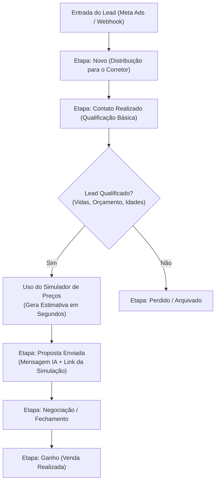
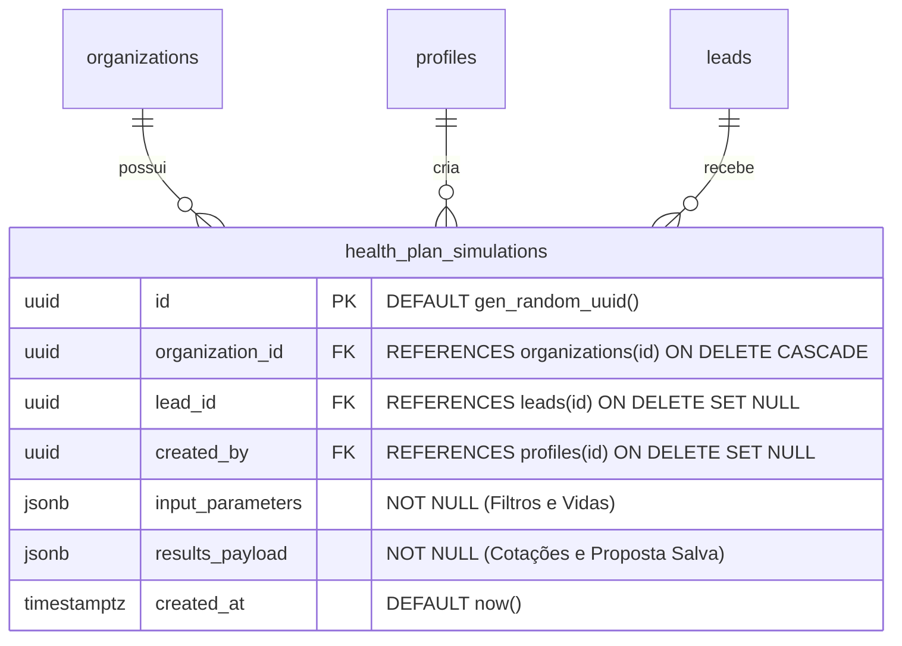

# Mapeamento Estratégico — Simulador de Preços
## SaaS Leadi — CRM com IA para Consultores e Corretores de Planos de Saúde

Este documento consolida o mapeamento de negócio, diagnóstico estratégico e planejamento de produto para a futura funcionalidade de **Simulador de Preços** do Leadi, em conformidade com a `TASK-073`.

---

## 1. Objetivo do Mapeamento

O objetivo deste diagnóstico é compreender e estruturar a real necessidade do **Simulador de Preços** no dia a dia do corretor de planos de saúde. Antes de codificar soluções ou desenhar telas complexas, precisamos delimitar o problema comercial que ele se propõe a resolver, quem é o usuário desse simulador, como ele se insere na jornada de vendas e por que ele deve ser tratado com prioridade secundária em relação ao core do CRM e da captação de leads.

---

## 2. O Problema Comercial do Corretor de Planos de Saúde

A venda de planos de saúde (individuais, familiares, PME ou corporativos) possui dores operacionais muito específicas. A principal delas reside na complexidade e fragmentação das informações de precificação:

*   **Dispersão e Desatualização de Tabelas**: Os corretores costumam lidar com dezenas de tabelas de preços em formato PDF, enviadas esparsamente pelas operadoras (Amil, Bradesco, SulAmérica, Unimed, NotreDame Intermédica, etc.). A chance de o corretor usar uma tabela desatualizada e passar um valor errado para o lead é altíssima.
*   **Perda do "Timing" da Venda**: Quando um lead qualificado demonstra interesse, o corretor precisa abrir múltiplos PDFs, somar os valores das vidas de acordo com a faixa etária de cada beneficiário, calcular taxas de angariação e coparticipação, e só então enviar o valor. Esse processo manual pode demorar horas. Na internet, o tempo de resposta é crucial: quanto mais tempo o corretor leva para enviar uma estimativa de preço, maior a taxa de desistência do lead ou a chance de ele fechar com um concorrente.
*   **Complexidade Multidimensional de Variáveis**: O preço de um plano de saúde varia de acordo com:
    1.  **Faixas Etárias** (0 a 18 anos, 19 a 23 anos, ..., até 59 anos ou mais);
    2.  **Tipo de Acomodação** (Enfermaria ou Apartamento);
    3.  **Abrangência Geográfica** (Regional, Estadual ou Nacional);
    4.  **Modelo de Contratação** (Com ou sem coparticipação);
    5.  **Tipo de CNPJ** (MEI, PME ou Grandes Grupos).

---

## 3. Público-Alvo e Usuário Ideal

O simulador de preços deve atender a duas personas operacionais distintas dentro do Leadi:

### Persona A: O Corretor Autônomo / Consultor Independente
*   **Perfil**: Atua sozinho, gerencia seus próprios leads vindos do Meta Ads e do tráfego orgânico.
*   **Necessidade**: Quer uma ferramenta rápida na ponta dos dedos (mobile-friendly) para estimar preços de 2 ou 3 operadoras enquanto conversa com o cliente por telefone ou WhatsApp, aumentando sua autoridade e velocidade.
*   **Dor Principal**: Tempo gasto calculando faixas etárias manualmente no papel ou Excel.

### Persona B: O Supervisor / Gerente Comercial de Equipes (Multi-tenant)
*   **Perfil**: Lidera um time de corretores contratados (Sellers) dentro de um plano corporativo.
*   **Necessidade**: Deseja garantir que toda a equipe utilize a mesma tabela oficial de vendas, evitando que vendedores novatos ou desatentos repassem valores incorretos aos clientes.
*   **Dor Principal**: Falta de padronização nas propostas enviadas pela equipe e reclamações de clientes sobre divergência de preços.

---

## 4. Momento Ideal de Uso na Jornada Comercial (Funil)

O simulador de preços não deve ser a porta de entrada da venda, mas sim um catalisador de conversão no meio do funil. O diagrama a seguir ilustra a inserção exata do simulador na jornada de atendimento do lead:

### Inserção Estratégica:
1.  **Qualificação prévia**: O corretor entra em contato, obtém os dados essenciais (número de vidas, idades dos beneficiários, preferência de hospitais, se possui CNPJ).
2.  **O ponto de inflexão (Simulador)**: Com esses dados capturados no prontuário do lead, o corretor abre o **Simulador de Preços**, seleciona as operadoras e gera a estimativa em 15 segundos.
3.  **Ação imediata**: O simulador gera um resumo em texto (pronto para ser enviado pelo botão de WhatsApp com IA) ou um link de visualização rápida para o cliente.

---

## 5. Justificativa de Prioridade (CRM Core vs. Simulador)

Embora o simulador de preços traga um "efeito uau" imediato e alto valor percebido, **ele deve continuar na Fase de Prioridade Baixa (Fase 10 / Simulador Futuro)** pelas seguintes razões estratégicas:

1.  **O funil e a captação de leads são o oxigênio do corretor**: Sem uma estrutura sólida de leads organizados, distribuição justa entre equipes (Multi-tenant) e integração estável com o Meta Ads (OAuth, webhooks), o corretor não terá para quem vender. Ter o melhor simulador do mundo em um sistema sem leads é inútil.
2.  **Complexidade extrema de manutenção das tabelas**: A criação de um motor de cálculo real exige a estruturação de um banco de dados de precificação altamente dinâmico, que precisa de atualização mensal (ou até semanal) devido aos reajustes das operadoras de saúde brasileiras. Desenvolver isso no core inicial do SaaS traria um custo de suporte e infraestrutura desproporcional.
3.  **Estratégia de MVP (Minimum Viable Product)**:
    *   **Fase Atual (TASK-073 a 075)**: Mapeamento de escopo, definição de campos e desenho arquitetural.
    *   **Fase Visual (TASK-076)**: Criação de um protótipo visual estático ("Em Breve") que serve de termômetro de interesse (CTA de clique para validar demanda dos usuários ativos).
    *   **Fase Real (Futura)**: Implementação real das tabelas após o core do CRM (leads, funil, IA de WhatsApp e distribuição de equipe) estar 100% maduro e escalável na Vercel.

---

## 6. Definição de Campos Mínimos (Entradas e Saídas — TASK-074)

Em conformidade com as restrições de manter o escopo enxuto, sem criar lógica comercial ou persistência neste momento, mapeamos os campos mínimos de entrada e saída necessários para que a futura interface e o banco de dados estejam integrados com o CRM.

### 6.1. Campos de Entrada (HealthPlanSimulatorInput)
Estes campos constituem o formulário de simulação que o corretor preencherá com base nos dados obtidos na qualificação do lead.

| Campo | Tipo / Valores Permitidos | Descrição | Justificativa Comercial |
| :--- | :--- | :--- | :--- |
| **organizationId** | `string` (UUID) | ID da Organização multi-tenant. | Garante o isolamento de dados por empresa e o compliance de acesso. |
| **leadId** | `string` (UUID) | ID do lead (opcional). | Permite salvar o histórico de simulações diretamente no prontuário do lead. |
| **cnpjType** | `MEI` \| `PME` \| `Adesão` \| `Física` | Tipo de contratação do plano de saúde. | Planos empresariais (MEI/PME) têm descontos agressivos (até 35% mais baratos) em relação à Pessoa Física. |
| **region** | `string` (Ex: "SP - Capital") | Praça/região de comercialização. | Operadoras de saúde alteram a precificação e a rede credenciada conforme o local de moradia do cliente. |
| **accommodation**| `Enfermaria` \| `Apartamento` | Tipo de internação hospitalar. | Acomodação em apartamento costuma ser de 15% a 25% mais cara que enfermaria (coletiva). |
| **coparticipation**| `Com Coparticipação` \| `Sem Coparticipação` | Modelo de pagamento de exames/consultas. | Planos coparticipativos reduzem o valor da mensalidade fixa em troca de taxas por utilização. |
| **beneficiaries** | Lista de `{ range: BeneficiaryRange, count: number }` | Quantidade de vidas por faixa etária da ANS. | A precificação oficial é calculada somando os valores individuais de cada beneficiário de acordo com a sua idade. |

#### Faixas Etárias Oficiais da ANS (BeneficiaryRange):
Os preços de planos de saúde no Brasil são rigidamente agrupados em 10 faixas etárias regulamentadas:
*   `0-18`: 0 a 18 anos
*   `19-23`: 19 a 23 anos
*   `24-28`: 24 a 28 anos
*   `29-33`: 29 a 33 anos
*   `34-38`: 34 a 38 anos
*   `39-43`: 39 a 43 anos
*   `44-48`: 44 a 48 anos
*   `49-53`: 49 a 53 anos
*   `54-58`: 54 a 58 anos
*   `59+`: 59 anos ou mais

---

### 6.2. Campos de Saída (HealthPlanSimulatorOutput)
A resposta gerada pelo motor de cálculo que será consumida pelo frontend para renderizar o comparativo de preços e enviar os orçamentos ao cliente.

| Campo | Tipo | Descrição | Importância para a Venda |
| :--- | :--- | :--- | :--- |
| **simulatorInput** | `HealthPlanSimulatorInput` | Cópia dos parâmetros de entrada da consulta. | Permite que o corretor visualize e reajuste os filtros da busca sem perder o contexto original. |
| **createdAt** | `string` (DateTime ISO) | Timestamp de geração da cotação. | Crucial para avisar o cliente sobre a validade do orçamento (normalmente tabelas mudam mensalmente). |
| **quotes** | Lista de `OperatorQuote` | Lista de cotações de planos encontradas compatíveis com os critérios. | Apresenta o comparativo de operadoras concorrentes (ex: Amil vs. Bradesco vs. Unimed). |
| **cheapestOption** | `OperatorQuote` (opcional) | A cotação com menor preço total absoluto. | Atalho de interface para destacar a opção mais econômica, ideal para leads sensíveis a preço. |
| **bestValueOption** | `OperatorQuote` (opcional) | A cotação com a melhor relação custo-benefício. | Destaca opções intermediárias com ampla rede de hospitais mas custo competitivo. |

#### Estrutura Detalhada de Cotação Individual (OperatorQuote):
*   `operatorName` (ex: "Bradesco Saúde")
*   `planName` (ex: "Saúde Top Nacional R1")
*   `pricePerRange`: Mapeamento de preços por faixa de idade cotada. Permite ao cliente auditar a soma de vidas.
*   `totalPrice`: Valor final mensal consolidado da proposta.
*   `accommodation`: Enfermaria ou Apartamento.
*   `coparticipation`: Com ou Sem Coparticipação.
*   `hasCnpjDiscount`: Flag indicativo se foi aplicado o desconto de contratação MEI/PME.

---

## 7. Modelagem de Dados Futura (Banco de Dados — TASK-075)

Para sustentar a persistência, o histórico e o compartilhamento das simulações de preços, estruturamos a modelagem de banco de dados ideal. Embora **nenhuma migração física ou tabela real seja criada nesta etapa** (conforme regras de escopo), esta arquitetura conceitual e física guiará as implementações futuras e garante o isolamento multi-tenant desde o início.

### 7.1. Desenho de Entidades e Relacionamentos (ER)

A simulação se conecta diretamente a três entidades centrais do Leadi:
1.  **organizations**: Garante o isolamento multi-tenant. Nenhuma simulação pode cruzar limites de organizações.
2.  **leads**: Vincula a simulação ao prontuário comercial de um lead no CRM.
3.  **profiles**: Identifica qual corretor/supervisor gerou a simulação para fins de auditoria e métricas.

### 7.2. Detalhamento da Tabela `health_plan_simulations`

| Coluna | Tipo SQL | Restrição / Default | Propósito Comercial e Técnico |
| :--- | :--- | :--- | :--- |
| **id** | `uuid` | `PRIMARY KEY`, `DEFAULT gen_random_uuid()` | Identificador único universal da simulação. Usado para gerar links públicos temporários de propostas. |
| **organization_id** | `uuid` | `NOT NULL`, `REFERENCES organizations(id) ON DELETE CASCADE` | ID da organização multi-tenant. Elemento de controle de acesso crucial para o isolamento de dados. |
| **lead_id** | `uuid` | `NULLABLE`, `REFERENCES leads(id) ON DELETE SET NULL` | ID do lead no CRM. Permite anexar a simulação à timeline de interações do lead sem quebrar o histórico caso o lead seja arquivado. |
| **created_by** | `uuid` | `NOT NULL`, `REFERENCES profiles(id) ON DELETE SET NULL` | Perfil do consultor que realizou a busca. Facilita o controle de produtividade e auditoria operacional de equipe. |
| **input_parameters**| `jsonb` | `NOT NULL` | Salva o payload completo da estrutura `HealthPlanSimulatorInput` (cnpjType, region, accommodation, coparticipation, beneficiaries). Usar JSONB garante suporte a alterações futuras nos campos sem quebrar o schema físico. |
| **results_payload** | `jsonb` | `NOT NULL` | Salva o payload completo da estrutura `HealthPlanSimulatorOutput` (quotes, cheapestOption, bestValueOption) no exato instante da geração. Planos sofrem reajustes frequentes; armazenar o resultado garante a imutabilidade do valor prometido ao cliente. |
| **created_at** | `timestamptz`| `DEFAULT now()` | Timestamp de registro para fins de expiração de validade do orçamento. |

### 7.3. Planejamento de Índices de Performance

Para garantir a rapidez do dashboard e do prontuário mesmo com grandes volumes de simulação, prevemos os seguintes índices físicos:
- `idx_simulations_organization`: Indexação por `organization_id` (essencial para queries rápidas no isolamento multi-tenant).
- `idx_simulations_lead`: Indexação por `lead_id` (acelera a renderização da timeline e prontuário do lead no popup do CRM).
- `idx_simulations_created_by`: Indexação por `created_by` (acelera relatórios de desempenho de vendas dos corretores).

### 7.4. Políticas RLS (Row Level Security) Planejadas

As regras de Row Level Security garantirão conformidade com a matriz de acessos multi-tenant:
- **Select / Read**: Permitido para perfis cuja organização coincida com a organização da simulação (`auth.uid()` mapeado para o perfil da mesma `organization_id`). Sellers acessam apenas simulações de leads que estão em sua própria carteira comercial (ou criadas por eles mesmos), enquanto Owners/Admins acessam todas as simulações da organização.
- **Insert / Create**: Permitido apenas para usuários autenticados pertencentes à mesma `organization_id` informada no payload de inserção.
- **Update / Delete**: Restrito a Owners/Admins para manutenção operacional, ou desativado (simulações de preços devem ser imutáveis para evitar alteração retroativa de propostas enviadas).

---

## 8. Conclusão e Próximos Passos

O **Simulador de Preços** é um excelente diferencial competitivo de retenção de clientes para o Leadi no longo prazo, mas o CRM e a automação de captação continuam sendo a proposta de valor principal. 

Com a conclusão das tarefas `TASK-073`, `TASK-074` e `TASK-075`, a modelagem de negócio, campos mínimos e estrutura futura de dados (relacionamentos ER, tabela e RLS) estão formalmente documentadas e as interfaces TypeScript mapeadas.

Como próximos passos recomendados no roadmap normalizado:
*   `TASK-076`: Criar o protótipo visual estático ("Em breve") na página de configurações ou dashboard do corretor para medir o interesse e validar a usabilidade sem codificar cálculos de runtime.
