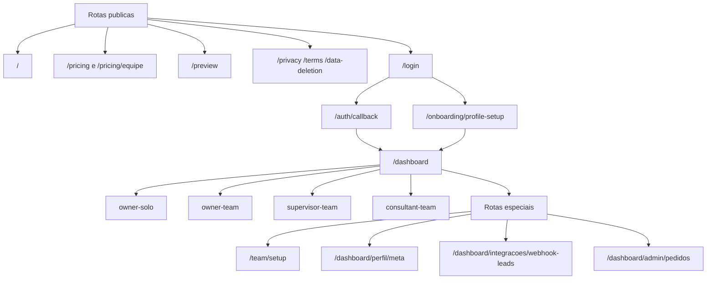
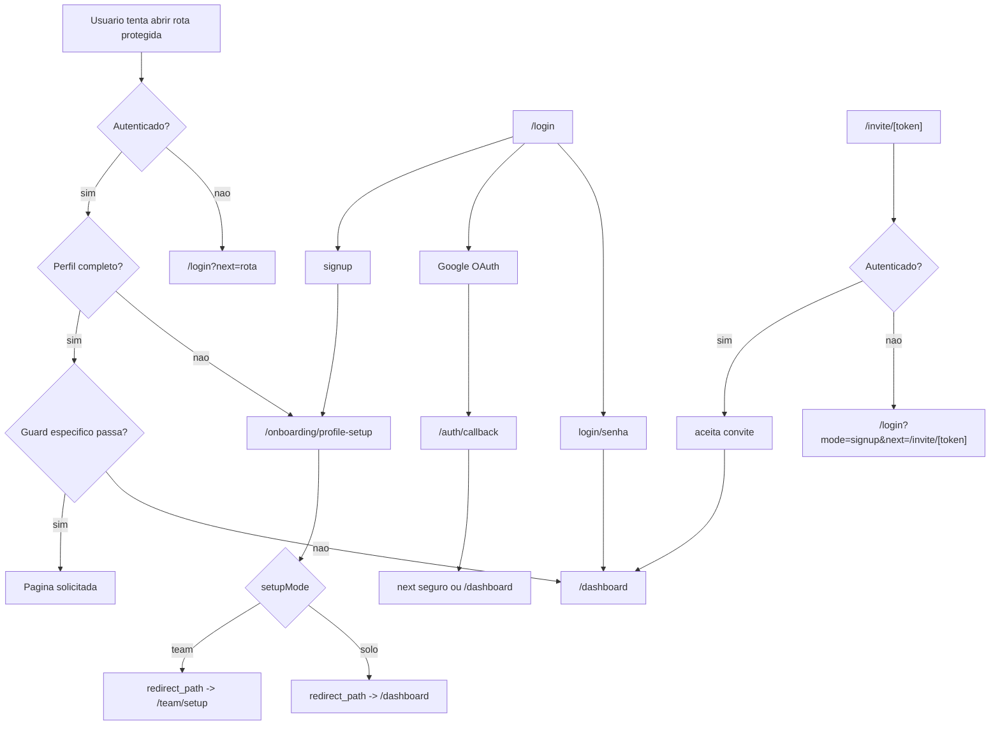
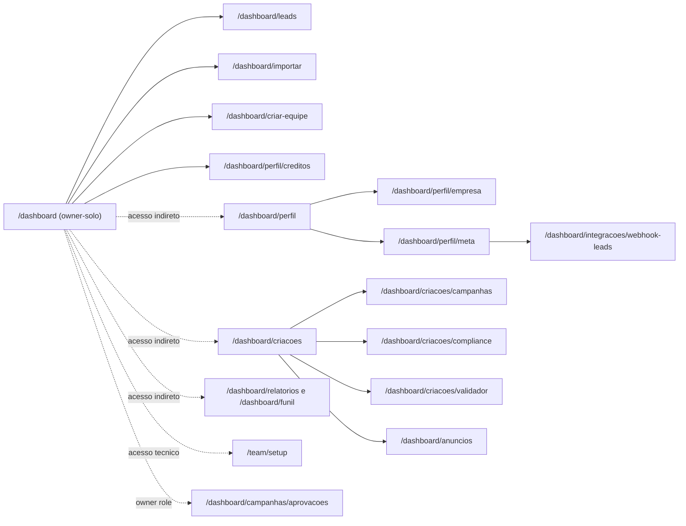
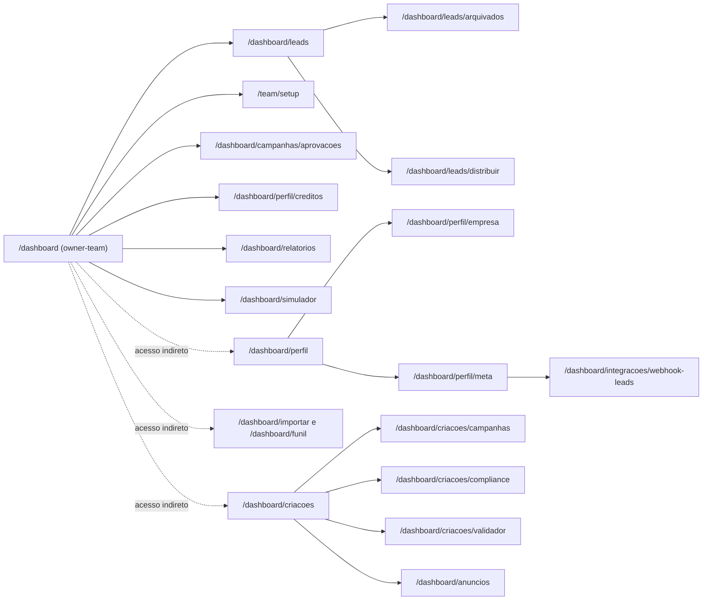
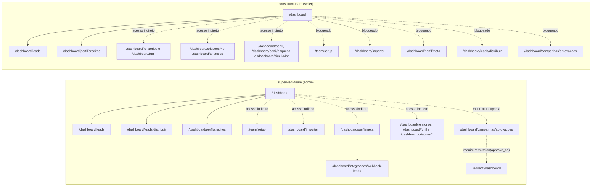

# Referencia de Rotas e Fluxos do Site

Data da fotografia: 2026-06-01

Escopo deste documento:

- fotografia auditavel da navegacao atual do Leadi;
- paginas do usuario e a rota tecnica `/auth/callback`;
- sem detalhar APIs e webhooks, exceto quando mudam o fluxo de navegacao.

Fontes auditadas:

- `app/`
- `middleware.ts`
- `src/lib/workspaces/context.ts`
- `src/lib/navigation.ts`
- `src/lib/workspaces/permissions.ts`
- `src/lib/workspaces/permission-map.ts`
- `docs/REFERENCIA_ROTAS_GUARDS.md`
- `docs/public-urls-checklist.md`
- `app/sitemap.ts`

Mapeamento de papeis usado neste arquivo:

- `owner` = Gestor
- `admin` = Supervisor
- `seller` = Consultor
- `platform_admin` = administrador interno da plataforma, fora do fluxo comercial comum

Observacao geral:

- este arquivo descreve o estado atual do codigo, inclusive quando a navegacao real e mais permissiva do que o menu sugere;
- os caminhos abaixo sao relativos ao dominio da aplicacao; para URL absoluta de producao, prefixar com `https://leadhealth.vercel.app`;
- quando uma rota for acessivel por URL, mas nao aparecer no menu principal, ela sera marcada como `acesso indireto/especial`;
- quando uma rota apenas redireciona para outra, ela sera marcada como `alias/redirect`.

## 1. Inventario Inicial de Rotas

### 1.1 Publicas e de entrada

| rota | tipo | autenticacao | papel | workspace | origem do guard | observacoes |
|---|---|---|---|---|---|---|
| `/` | landing page | publica | qualquer | n/a | publica | home institucional com CTA para `/login` e `/pricing`. |
| `/pricing` | marketing/precos | publica | qualquer | n/a | publica | pagina principal de planos. |
| `/pricing/equipe` | marketing/precos | publica | qualquer | n/a | publica | landing publica focada no plano de equipe. |
| `/preview` | demo publica | publica | qualquer | n/a | publica | renderiza `DashboardShell` em modo preview com nav de `owner-team`. |
| `/privacy` | pagina legal | publica | qualquer | n/a | publica | politica de privacidade. |
| `/terms` | pagina legal | publica | qualquer | n/a | publica | termos de uso. |
| `/data-deletion` | pagina legal | publica | qualquer | n/a | publica | pagina publica de exclusao de dados; aceita `code` e `status` na query. |
| `/login` | autenticacao | publica | qualquer | n/a | publica | suporta `mode=login/signup` e `next` seguro. |
| `/auth/callback` | callback tecnico | publica | qualquer | n/a | rota tecnica | conclui o OAuth e redireciona para `next` ou `/dashboard`. |
| `/onboarding/profile-setup` | onboarding | autenticado | qualquer autenticado com setup pendente | qualquer | `middleware` + `getCurrentWorkspaceContext()` | se o perfil ja estiver completo, redireciona para `/dashboard`. |
| `/invite/[token]` | convite | autenticado | usuario convidado | team | `middleware` + pagina | sem login, volta para `/login?mode=signup&next=/invite/[token]`; com login, tenta aceitar o convite. |
| `/checkout` | checkout | autenticado | qualquer autenticado | qualquer | `middleware` + pagina | sem login, volta para `/login?next=/checkout...`; suporta fluxo de plano e de creditos. |

### 1.2 Dashboard e paginas protegidas

| rota | tipo | autenticacao | papel | workspace | origem do guard | observacoes |
|---|---|---|---|---|---|---|
| `/dashboard` | dashboard raiz | autenticado + perfil completo | qualquer | qualquer | `middleware` + `requireCompletedProfile()` | troca de experiencia conforme `DashboardNavVariant`. |
| `/dashboard/leads` | CRM | autenticado + perfil completo | qualquer | qualquer | `requireCompletedProfile()` | dados e acoes mudam conforme o papel. |
| `/dashboard/leads/arquivados` | CRM | autenticado + perfil completo | qualquer | qualquer | `requireCompletedProfile()` | mesma base de leads, forcando filtro `archived=true`. |
| `/dashboard/leads/distribuir` | CRM | autenticado + perfil completo | `owner` ou `admin` | qualquer | `requireCompletedProfile()` + redirect na pagina | se nao for manager, redireciona para `/dashboard/leads`. |
| `/dashboard/funil` | CRM/funil | autenticado + perfil completo | qualquer | qualquer | `requireCompletedProfile()` | rota sem item proprio no menu principal. |
| `/dashboard/importar` | importacao | autenticado + perfil completo | `owner` ou `admin` | qualquer | `requireImportPermission()` | no produto real: owner solo ou manager de equipe. |
| `/dashboard/criar-equipe` | equipe | autenticado + perfil completo | `owner` | `solo` | `requireSoloOwner()` | placeholder do fluxo `solo -> team`. |
| `/team/setup` | equipe | autenticado + perfil completo | `owner` ou `admin` | qualquer | `middleware` + `requireWorkspaceManager()` | em `team`, e a tela de gestao; em `solo`, vira tela placeholder de workspace individual. |
| `/dashboard/campanhas/aprovacoes` | campanhas | autenticado + perfil completo | `owner` | qualquer | `requirePermission("approve_ad")` | rota de aprovacao; o papel `admin` nao entra. |
| `/dashboard/criacoes` | hub de criacao | autenticado + perfil completo | qualquer | qualquer | `requireCompletedProfile()` | hub para campanhas, compliance, validador e anuncios. |
| `/dashboard/criacoes/campanhas` | criacao | autenticado + perfil completo | qualquer | qualquer | `requireCompletedProfile()` | gerador de campanhas. |
| `/dashboard/criacoes/compliance` | criacao | autenticado + perfil completo | qualquer | qualquer | `requireCompletedProfile()` | validador de texto/compliance. |
| `/dashboard/criacoes/validador` | criacao | autenticado + perfil completo | qualquer | qualquer | `requireCompletedProfile()` | acompanhamento e validacao de criacoes/pedidos. |
| `/dashboard/anuncios` | campanhas | autenticado + perfil completo | qualquer | qualquer | `requireCompletedProfile()` via layout | acessivel por URL e pelo hub de criacoes; nao tem item proprio no menu lateral. |
| `/dashboard/relatorios` | relatorios | autenticado + perfil completo | qualquer | qualquer | `requireCompletedProfile()` | escopo do relatorio muda conforme o contexto do usuario. |
| `/dashboard/simulador` | simulador | autenticado + perfil completo | qualquer | qualquer | `requireCompletedProfile()` | hoje abre o prototipo de simulador de precos. |
| `/dashboard/perfil` | perfil | autenticado + perfil completo | qualquer | qualquer | `requireCompletedProfile()` | hub de conta, empresa, Meta e creditos. |
| `/dashboard/perfil/empresa` | perfil | autenticado + perfil completo | qualquer | qualquer | `requireCompletedProfile()` | resumo da empresa/workspace. |
| `/dashboard/perfil/creditos` | perfil | autenticado + perfil completo | qualquer | qualquer | `requireCompletedProfile()` | owner compra, admin solicita, seller apenas acompanha saldo. |
| `/dashboard/perfil/meta` | perfil/integracoes | autenticado + perfil completo | `owner` ou `admin` | qualquer | `requireWorkspaceManager()` | owner solo tambem entra porque continua sendo manager. |
| `/dashboard/integracoes/webhook-leads` | integracoes | autenticado + perfil completo | `owner` ou `admin` | qualquer | `requireWorkspaceManager()` | owner solo tambem entra; logs e token por organizacao. |
| `/dashboard/admin/pedidos` | backoffice | autenticado + perfil completo | `platform_admin` | qualquer | `requirePlatformAdmin()` | area interna da plataforma. |

### 1.3 Aliases e redirects internos

| rota | tipo | autenticacao | papel | workspace | origem do guard | observacoes |
|---|---|---|---|---|---|---|
| `/dashboard/campanhas` | alias/redirect | autenticado + perfil completo | qualquer | qualquer | redirect na pagina | vai para `/dashboard/criacoes/campanhas`. |
| `/dashboard/compliance` | alias/redirect | autenticado + perfil completo | qualquer | qualquer | redirect na pagina | vai para `/dashboard/criacoes/compliance`. |
| `/dashboard/pedidos` | alias/redirect | autenticado + perfil completo | qualquer | qualquer | redirect na pagina | vai para `/dashboard/criacoes/validador`. |
| `/dashboard/creditos` | alias/redirect | autenticado + perfil completo | qualquer | qualquer | redirect na pagina | vai para `/dashboard/perfil/creditos`, preservando `purchase` e `status`. |
| `/dashboard/empresa` | alias/redirect | autenticado + perfil completo | qualquer | qualquer | redirect na pagina | vai para `/dashboard/perfil/meta`, preservando `meta`, `openai` e `sync`. |
| `/dashboard/whatsapp` | alias/redirect | autenticado + perfil completo | qualquer | qualquer | redirect na pagina | vai para `/dashboard/leads?panel=message` ou abre um lead especifico. |

## 2. Regras Centrais de Navegacao e Bloqueio

Regras do `middleware.ts`:

- rotas protegidas exigem login: `dashboard`, `team`, `invite`, `checkout` e `api` (com excecoes de webhook/callback externo);
- usuario sem login em rota protegida vai para `/login?next=...`;
- usuario autenticado com setup pendente vai para `/onboarding/profile-setup`;
- usuario com setup concluido que abre `/onboarding/profile-setup` volta para `/dashboard`;
- `/team/*` exige `isManager`;
- `/dashboard/importar` exige permissao `import_leads`;
- `/dashboard/criar-equipe` exige `owner` em workspace `solo`.

Regras dos helpers server-side em `src/lib/workspaces/context.ts`:

- `requireCompletedProfile()` protege praticamente todo o dashboard;
- `requireWorkspaceManager()` protege `perfil/meta`, `webhook-leads` e `team/setup`;
- `requireImportPermission()` protege `importar`;
- `requireSoloOwner()` protege `criar-equipe`;
- `requirePermission("approve_ad")` protege `campanhas/aprovacoes`;
- `requirePlatformAdmin()` protege `/dashboard/admin/pedidos`.

## 3. Mapa Macro do Produto

## 4. Fluxo Publico, Auth e Onboarding

Resumo do fluxo real:

- CTA publico costuma levar a `/login`;
- `signUpAction()` manda o usuario novo para `/onboarding/profile-setup` quando o `next` padrao e `/dashboard`;
- o callback OAuth troca o `code` por sessao e redireciona para `next` seguro;
- o onboarding executa `complete_profile_setup` no Supabase e usa o `redirect_path` devolvido pela RPC;
- no estado atual, o esperado e:
  - `setupMode=solo` -> `/dashboard`
  - `setupMode=team` -> `/team/setup`
- se o usuario tentar abrir uma rota protegida sem permissao especifica, o fallback costuma ser `/dashboard`.

## 5. Experiencia `owner-solo`

Contexto:

- nav variant: `owner-solo`
- papel tecnico: `owner`
- workspace: `solo`
- dashboard raiz: `DashboardHome`

Menu visivel:

- `/dashboard`
- `/dashboard/leads`
- `/dashboard/importar`
- `/dashboard/criar-equipe`
- `/dashboard/perfil/creditos`

Acesso indireto/especial:

- `/dashboard/perfil`
- `/dashboard/perfil/empresa`
- `/dashboard/perfil/meta`
- `/dashboard/integracoes/webhook-leads`
- `/dashboard/relatorios`
- `/dashboard/funil`
- `/dashboard/criacoes`
- `/dashboard/criacoes/campanhas`
- `/dashboard/criacoes/compliance`
- `/dashboard/criacoes/validador`
- `/dashboard/anuncios`
- `/team/setup`
- `/dashboard/campanhas/aprovacoes`
- aliases `/dashboard/creditos`, `/dashboard/empresa`, `/dashboard/whatsapp`, `/dashboard/campanhas`, `/dashboard/compliance`, `/dashboard/pedidos`

Bloqueios e redirects relevantes:

- `/dashboard/admin/pedidos` continua bloqueada por `requirePlatformAdmin()`;
- `/dashboard/leads/distribuir` entra porque `owner` tambem e manager;
- `/dashboard/perfil/meta` e `/dashboard/integracoes/webhook-leads` tambem entram pelo mesmo motivo.

Observacoes do estado atual:

- mesmo sendo workspace individual, o `owner-solo` ainda passa pelos guards de manager;
- por isso, rotas de equipe/integracao aparecem como acessiveis por URL, embora o uso de produto faca mais sentido no modo `team`;
- `/team/setup` nao quebra em `solo`: vira uma tela placeholder de workspace individual.

## 6. Experiencia `owner-team`

Contexto:

- nav variant: `owner-team`
- papel tecnico: `owner`
- workspace: `team`
- dashboard raiz: `ManagerDashboard`

Menu visivel:

- `/dashboard`
- `/dashboard/leads`
- `/team/setup`
- `/dashboard/campanhas/aprovacoes`
- `/dashboard/perfil/creditos`
- `/dashboard/relatorios`
- `/dashboard/simulador`

Acesso indireto/especial:

- `/dashboard/leads/arquivados`
- `/dashboard/leads/distribuir`
- `/dashboard/importar`
- `/dashboard/perfil`
- `/dashboard/perfil/empresa`
- `/dashboard/perfil/meta`
- `/dashboard/integracoes/webhook-leads`
- `/dashboard/funil`
- `/dashboard/criacoes`
- `/dashboard/criacoes/campanhas`
- `/dashboard/criacoes/compliance`
- `/dashboard/criacoes/validador`
- `/dashboard/anuncios`
- aliases `/dashboard/creditos`, `/dashboard/empresa`, `/dashboard/whatsapp`, `/dashboard/campanhas`, `/dashboard/compliance`, `/dashboard/pedidos`

Bloqueios e redirects relevantes:

- `/dashboard/criar-equipe` redireciona para `/dashboard`, porque so existe para `owner` em `solo`;
- `/dashboard/admin/pedidos` continua exclusiva de `platform_admin`.

Observacoes do estado atual:

- esta e a experiencia mais completa do workspace comercial;
- o menu lateral cobre o nucleo de leads, equipe, aprovacao, creditos, relatorios e configuracoes;
- o hub `/dashboard/criacoes` continua fora do menu lateral, mas tem atalho pelo botao flutuante de criacao.

## 7. Experiencias `supervisor-team` e `consultant-team`

### 7.1 `supervisor-team`

Contexto:

- nav variant: `supervisor-team`
- papel tecnico: `admin`
- workspace: `team`
- dashboard raiz: `SupervisorDashboard`

Menu visivel:

- `/dashboard`
- `/dashboard/leads`
- `/dashboard/leads/distribuir`
- `/dashboard/campanhas/aprovacoes`
- `/dashboard/perfil/creditos`

Acesso indireto/especial:

- `/team/setup`
- `/dashboard/importar`
- `/dashboard/perfil`
- `/dashboard/perfil/empresa`
- `/dashboard/perfil/meta`
- `/dashboard/integracoes/webhook-leads`
- `/dashboard/relatorios`
- `/dashboard/funil`
- `/dashboard/leads/arquivados`
- `/dashboard/criacoes`
- `/dashboard/criacoes/campanhas`
- `/dashboard/criacoes/compliance`
- `/dashboard/criacoes/validador`
- `/dashboard/anuncios`
- aliases `/dashboard/creditos`, `/dashboard/empresa`, `/dashboard/whatsapp`, `/dashboard/campanhas`, `/dashboard/compliance`, `/dashboard/pedidos`

Bloqueios e redirects relevantes:

- `/dashboard/campanhas/aprovacoes` aparece no menu atual, mas a rota exige `approve_ad`, que no mapa de permissoes pertence apenas a `owner`;
- na pratica, o supervisor clica e volta para `/dashboard`;
- `/dashboard/criar-equipe` e `/dashboard/admin/pedidos` continuam bloqueadas.

### 7.2 `consultant-team`

Contexto:

- nav variant: `consultant-team`
- papel tecnico: `seller`
- workspace: `team`
- dashboard raiz: `ConsultantDashboard`

Menu visivel:

- `/dashboard`
- `/dashboard/leads`
- `/dashboard/perfil/creditos`

Acesso indireto/especial:

- `/dashboard/relatorios`
- `/dashboard/funil`
- `/dashboard/simulador`
- `/dashboard/perfil`
- `/dashboard/perfil/empresa`
- `/dashboard/leads/arquivados`
- `/dashboard/criacoes`
- `/dashboard/criacoes/campanhas`
- `/dashboard/criacoes/compliance`
- `/dashboard/criacoes/validador`
- `/dashboard/anuncios`
- aliases `/dashboard/creditos`, `/dashboard/whatsapp`, `/dashboard/campanhas`, `/dashboard/compliance`, `/dashboard/pedidos`

Bloqueios e redirects relevantes:

- `/team/setup` bloqueia e volta para `/dashboard`;
- `/dashboard/importar` bloqueia e volta para `/dashboard`;
- `/dashboard/perfil/meta` bloqueia e volta para `/dashboard`;
- `/dashboard/integracoes/webhook-leads` bloqueia e volta para `/dashboard`;
- `/dashboard/leads/distribuir` redireciona para `/dashboard/leads`;
- `/dashboard/campanhas/aprovacoes` bloqueia e volta para `/dashboard`;
- `/dashboard/criar-equipe` bloqueia e volta para `/dashboard`;
- `/dashboard/admin/pedidos` bloqueia e volta para `/dashboard`;
- `/dashboard/empresa` parece neutra no nome, mas redireciona para `/dashboard/perfil/meta`, que tambem fica bloqueada para consultor.

Observacoes do estado atual:

- o consultor tem menu curto, mas ainda consegue abrir varias paginas por URL porque muitas rotas usam apenas `requireCompletedProfile()`;
- nessas paginas, o escopo real costuma ser limitado pelos repositories, pelo `permission-map` ou pela propria UI;
- por isso, a experiencia pratica e mais restrita que o inventario bruto de URLs.

## 8. Observacoes Importantes do Estado Atual

1. O menu `supervisor-team` aponta para `/dashboard/campanhas/aprovacoes`, mas a pagina exige `approve_ad`, hoje reservado a `owner`.
2. O `owner-solo` continua sendo manager para varios guards, entao acessa `/team/setup`, `/dashboard/perfil/meta`, `/dashboard/integracoes/webhook-leads` e `/dashboard/campanhas/aprovacoes` mesmo fora do modo `team`.
3. O menu principal nao representa toda a superficie navegavel: varias rotas do dashboard continuam acessiveis por URL e dependem de escopo de dados ou de elementos da UI para parecerem mais restritas.
4. O sitemap publico (`app/sitemap.ts`) lista apenas um subconjunto das URLs publicas. Rotas como `/pricing/equipe`, `/login` e `/checkout` nao entram nele.

## 9. Como Atualizar Este Mapa

Checklist curto:

- revisar novos `page.tsx` e `route.ts` relevantes dentro de `app/`;
- revisar `middleware.ts` para novos redirects globais;
- revisar `src/lib/workspaces/context.ts` para novos `require*`;
- revisar `src/lib/navigation.ts` para mudancas no menu por `DashboardNavVariant`;
- revisar guards especiais em paginas como `leads/distribuir`, `campanhas/aprovacoes`, `perfil/meta`, `webhook-leads`, `criar-equipe` e `admin/pedidos`;
- revisar aliases que apenas redirecionam para outras paginas;
- validar se algum item novo entrou no menu, mas continua bloqueado por outra camada;
- comparar as rotas publicas com `app/sitemap.ts` e com a documentacao publica do produto.
