# Referência do Sistema de Créditos

Este documento descreve o fluxo atual de compra, consumo e gerenciamento de créditos de IA no Leadi, e detalha os pontos de integração necessários para implementar a gestão de wallets por equipe e usuário (Plano Equipe).

## 1. Tabelas Principais (Atual)

- **`org_ai_balances`**: Tabela central que armazena o saldo principal (`available_credits`) e é vinculada diretamente à organização (`org_id`).
- **`ai_credit_ledger`**: Tabela de histórico de movimentações financeiras (compras, usos, reembolsos, ajustes). Toda transação nesta tabela reflete no saldo da organização e guarda o `balance_after`.
- **`ai_credit_orders`**: Tabela que gerencia os pedidos de compra feitos através do checkout (Mercado Pago).
- **`ai_credit_packages`**: Tabela contendo os pacotes de créditos disponíveis para compra.
- **`ai_usage_events`**: Tabela para auditoria do uso de tokens e custo estimado das requisições na OpenAI.

## 2. Funções RPC no Banco (Atual)

O banco de dados usa funções em PL/pgSQL (RPCs) para garantir atomicidade nas operações de saldo e ledger:
- **`add_ai_credits`**: Adiciona saldo à organização e insere registro no ledger (`type` = 'purchase', 'refund', etc).
- **`consume_ai_credits`**: Deduz saldo da organização e insere registro de `usage` no ledger. Dispara erro de saldo insuficiente se o saldo for menor que o necessário.
- **`finalize_ai_credit_order_payment`**: Atualiza o status do pedido para `paid` e deposita os créditos na organização via inserção indireta de ledger.

## 3. Fluxograma do Sistema Atual

```mermaid
flowchart TD
    subgraph Compra
        A[Usuário inicia checkout] --> B[Cria pedido em ai_credit_orders]
        B --> C[Webhook do Mercado Pago]
        C --> D[RPC: finalize_ai_credit_order_payment]
        D --> E[Soma em org_ai_balances]
        D --> F[Registra 'purchase' no ai_credit_ledger]
    end

    subgraph Consumo
        G[Ação de IA: runAiActionWithCredits] --> H[Calcula custo em credit-costs.ts]
        H --> I[RPC: consume_ai_credits]
        I --> J{Saldo suficiente?}
        J -->|Sim| K[Subtrai de org_ai_balances]
        K --> L[Registra 'usage' em ai_credit_ledger]
        L --> M[Executa prompt na OpenAI]
        M --> N[Loga métricas em ai_usage_events]
        J -->|Não| O[Erro: insufficient_credits]
    end
```

## 4. Pontos de Integração para Wallets (Equipe / Usuário)

O Plano Equipe precisará alterar a forma como os créditos são consumidos e solicitados.

**Onde as integrações devem acontecer:**

1. **Na Camada de Banco de Dados:**
   - Será necessário criar tabelas `credit_wallets` (para `team` e `user`) vinculadas à `organization_id`.
   - Será preciso adaptar a tabela (ou adicionar uma nova tabela) `credit_transactions` para apontar o histórico de carteiras específicas, preservando a lógica mestra que atualiza a `org_ai_balances` ou mantendo saldos separados mas somáveis.

2. **Na Camada Backend (`credits.ts`):**
   - Atualizar a verificação `getCurrentAiBalance()` e `ensureSufficientCredits()` para validar qual o contexto do usuário (se consultor, checar a carteira do usuário; se gestor, checar carteira da organização).
   - O consumo (`consumeAiCredits`) deverá repassar informações de qual `credit_wallet` ou `team_id` está sendo afetado pela ação.

3. **Na Interface do Cliente (`app/dashboard/creditos/` e `app/api/billing/ai-credits/`):**
   - Apenas o perfil `Gestor` (`owner`) poderá ver e acessar a rota de compra.
   - Supervisores precisarão de uma nova rota/componente para "Solicitar Créditos" (`credit_requests`), substituindo o checkout por um fluxo de aprovação.
   - Os componentes de workspace precisarão ler as carteiras secundárias em vez de ler apenas o saldo global da organização.
